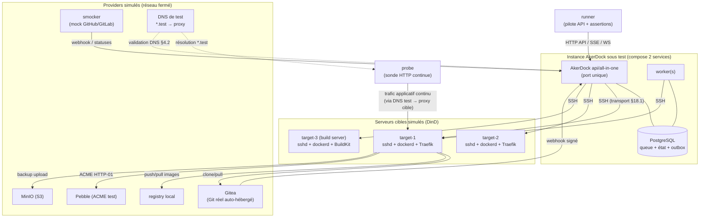

# Spécification — Plan de tests E2E

> Artefact §29.9 du PRD (`docs/PRD.md`). Le PRD est la source de vérité ; ce document précise l'architecture du harnais, la pyramide de tests, le catalogue de scénarios E2E, les tests de sécurité (§23.5) et de charge (§22.2), les fixtures, l'étagement CI et la traçabilité (invariants §17 × scénarios ; matrice de parité §26.2 × scénarios).
>
> **Cadre imposé (décision §27.26, ADR-026)** : les E2E automatisés s'exécutent **exclusivement en Docker-in-Docker (DinD)**. Les serveurs cibles sont **simulés en containers**. Aucune VM n'est réintroduite. Le risque résiduel (systemd, reboots réels, firewalls, disques pleins physiques, ARM64) est **explicitement accepté** et validé manuellement hors automatisation ; il est renvoyé à l'ADR-026 à chaque endroit où il compte.
>
> Lorsque le PRD et la spec moteur (`deployment-engine.md`) sont muets sur un paramètre de test, la valeur retenue est marquée **(défaut proposé)**.

---

## 1. Architecture du harnais DinD

### 1.1 Topologie

Le harnais monte, pour chaque exécution de suite, une **stack éphémère et hermétique** (aucun accès Internet sortant : tout provider externe est simulé localement). Elle comprend :

- **Instance AkerDock sous test** — la distribution de production réelle (§27.21) : `docker compose` à **2 services**, l'image AkerDock (mode `all-in-one`, ou `api` + `worker` séparés pour les scénarios multi-instance §22.1) + PostgreSQL. C'est le **système sous test (SUT)**, jamais mocké.
- **N « serveurs cibles » simulés** (`target-1..N`) — containers jouant le rôle de serveurs Linux distants : **sshd** (clé publique injectée) + **dockerd en DinD** (`--privileged` ou `sysbox` selon disponibilité runner). C'est sur eux que AkerDock déploie via SSH. Défaut : **N = 3** (multi-serveurs, isolation, build server) **(défaut proposé)**.
- **Gitea** — provider Git **réel** auto-hébergé (container) : dépôts publics/privés, deploy keys, webhooks sortants signés, API PR/MR, commit statuses. Sert de provider de référence « bout-en-bout vrai ».
- **smocker** (ou mountebank) — **mock programmable** des APIs GitHub / GitLab : checks, commit statuses, Deployments API, commentaires de PR, signatures HMAC. Permet d'exercer la parité multi-providers sans réseau externe et d'injecter des réponses d'erreur.
- **MinIO** — S3 compatible pour backups, restore, restore drills et storage de volumes (§20.5).
- **Registry local** (`registry:2`) — push/pull d'images, rollback par digest OCI (§27.6).
- **Pebble** — serveur **ACME de test** de Let's Encrypt : émission/renouvellement de certificats HTTP-01 dans un environnement fermé (§4.3).
- **Résolveur DNS de test** (CoreDNS/dnsmasq) — `*.test` et les wildcards de preview résolvent vers le proxy du serveur cible concerné ; sert aussi de DNS de validation (§4.2).
- **Sonde HTTP continue** (`probe`) — client de charge léger (voir §5) qui martèle les URLs applicatives pendant les bascules pour prouver le zero-downtime (§20.2, INV-005).
- **Harness/orchestrateur de test** (`runner`) — pilote l'API AkerDock, injecte fixtures et seeds, observe l'état distant via `docker` sur les cibles, collecte logs/dumps/artefacts.

### 1.2 Schéma

### 1.3 Contraintes DinD documentées (renvoi ADR-026)

| Contrainte | Conséquence sur les tests | Traitement |
|---|---|---|
| **Pas de systemd** dans les cibles | Les scénarios ne peuvent pas exercer `systemctl`, unités, boot dependencies | Onboarding installe/valide Docker via chemins non-systemd ; l'interaction systemd réelle est **hors automatisation, risque accepté ADR-026** |
| **cgroups partagés / imbriqués** (DinD) | Les resource limits (§27.15) sont vérifiées au niveau **configuration appliquée** (`docker inspect` : `Memory`, `NanoCpus`, `CpusetCpus`) et non par une mesure d'OOM-kill fiable | Assertion sur les valeurs cgroup vues par le dockerd imbriqué ; la vérification d'enforcement physique reste une validation manuelle |
| **Pas de reboot réel** | Comportement post-reboot d'un serveur non testable | Simulé partiellement par `docker restart` du dockerd cible ; le vrai reboot est **hors automatisation, risque accepté** |
| **Firewall / UFW / disque plein physique** | Non reproductibles fidèlement | « Disque insuffisant » simulé par un montage `tmpfs` de taille bornée sur la cible (voir E2E-SRV-06) ; le firewall réel est **hors automatisation, risque accepté** |
| **ARM64** | Runners CI AMD64 | Matrice ARM64 **hors automatisation, risque accepté ADR-026** ; tracée « VM/ARM64 non automatisé » dans la matrice §26.2 |
| **`--privileged` requis** | Surface CI élevée ; DinD parfois indisponible | Préférence pour **sysbox** si disponible (isolation renforcée) ; fallback `--privileged` **(défaut proposé)** |

Toute classe de bug listée « hors automatisation » ci-dessus est **explicitement acceptée (ADR-026)** et fait l'objet d'une checklist de validation manuelle ponctuelle (§7.5), pas d'un pipeline VM.

---

## 2. Pyramide de tests et périmètres

| Niveau | Portée | Outillage | Dans ce doc ? | Cadence |
|---|---|---|---|---|
| **Unit** | Fonctions pures : échappement shell (INV-012), génération IR proxy, interpolation de variables, parseurs, calcul de rétention | `go test` | **Hors scope** (cité pour situer) | Chaque commit |
| **Intégration (module)** | Un module réel contre une dépendance réelle jetable, **sans le produit complet** — via **testcontainers-go** : queue/leases/outbox sur PostgreSQL réel ; secret store (chiffrement enveloppe, rotation de clé) ; adaptateur SSH contre un sshd containerisé ; génération proxy contre Traefik/Caddy réels (fixtures §29.6) ; adaptateur runtime contre un dockerd réel | testcontainers-go | Périmètre voisin (référencé) | Chaque commit |
| **E2E produit** | La stack §1 complète, AkerDock réel de bout en bout | runner + DinD | **Ce plan** | Smoke à chaque commit, catalogue complet nightly |
| **Sécurité** | Injection, fuzzing, webhooks malveillants, concurrence (§23.5) | go-fuzz + runner + smocker | **Ce plan** (§4) | Cas rapides à chaque commit, fuzzing/corpus nightly |
| **Charge** | Profils de capacité §22.2 | k6 / vegeta + seeds | **Ce plan** (§5) | Nightly + avant release |

**Règle de sélection E2E vs intégration** : un comportement testable au niveau module contre sa dépendance (ex. FIFO de la queue, sémantique de lease) est couvert en **intégration** (rapide, ciblé) ; l'E2E ne le rejoue que là où l'assemblage complet apporte une preuve que le module isolé ne donne pas (ex. « aucune requête perdue pendant la bascule » exige proxy + container + sonde réels).

**Ce qui tourne à chaque commit (E2E smoke, budget ~10 min)** : vertical slice P0 — E2E-SRV-01, E2E-DEP-01, E2E-ZDT-01, E2E-PXY-01, E2E-DEL-01, E2E-RBAC-01, plus la suite d'intégration complète et les cas de sécurité rapides.

**Ce qui tourne en nightly** : catalogue E2E complet (§3), fuzzing avec corpus (§4.2), profils de charge (§5), matrice multi-providers/multi-moteurs/multi-build-packs.

---

## 3. Catalogue de scénarios E2E

Convention d'identifiant : `E2E-<domaine>-<nn>`. Chaque scénario liste **préconditions**, **étapes**, **assertions**, **invariants couverts**. Sauf mention contraire, l'assertion finale inclut : aucun secret en clair dans logs/événements/audit (INV-003), audit exploitable produit (§23.4), verrous/slots libérés (§9 spec moteur).

Domaines : `SRV` onboarding serveur · `DEP` déploiement · `ZDT` zero-downtime · `RBK` rollback · `WHK` webhooks · `PRV` previews · `DB` bases/backups · `DEL` suppression · `ADO` adoption · `COORD` déploiement coordonné · `CAC` config-as-code · `PXY` proxy/certs · `RBAC` isolation/RBAC · `TERM` terminal · `NOTIF` notifications · `CMP` compose/services · `UPT` uptime · `CLI` `akerdock up` · `OBS` observabilité.

### 3.1 Onboarding serveur — §20.1 (P0)

Couvre chaque cas d'erreur d'acceptation du §20.1 (chacun « une erreur distincte sans serveur faussement `ready` »).

| ID | Préconditions | Étapes | Assertions | INV |
|---|---|---|---|---|
| **E2E-SRV-01** (nominal) | `target-1` frais, clé de la team A | Créer serveur `pending` → lancer validation → attendre `ready` | Passe par `pending→validating→ready` ; Docker/proxy/Sentinel présents ; réseau/dossiers `/data/akerdock` créés ; chaque étape loguée/rejouable | INV-004, INV-011 |
| **E2E-SRV-02** (mauvais host key) | Host key de `target-1` modifié après 1er contact | Relancer validation | Erreur distincte `ssh_host_key_mismatch` ; serveur **non** `ready` ; remédiation fournie | INV-004 |
| **E2E-SRV-03** (clé d'une autre team) | Clé appartenant à team B, serveur créé sous team A | Créer serveur en référençant la clé de B | Rejet à l'API (référence inter-team refusée) ; aucun `Server` créé | INV-002 |
| **E2E-SRV-04** (Docker snap) | `target` expose un `docker` factice signalant une install snap | Validation | Erreur distincte `docker_snap_unsupported` ; non `ready` | INV-004 |
| **E2E-SRV-05** (sudo interactif) | User non-root sans `NOPASSWD`, sudo demande un mot de passe | Validation | Détection du prompt sudo → erreur `sudo_requires_password` (pas de blocage/hang) ; non `ready` | INV-004 |
| **E2E-SRV-06** (disque insuffisant) | `/data` de la cible sur tmpfs < seuil 2 GiB (§4 `preparing`) | Validation | Erreur `insufficient_disk` avec seuil requis ; non `ready` | INV-004 |
| **E2E-SRV-07** (timeout SSH) | Cible avec sshd injoignable (port fermé/latence > timeout) | Validation | Erreur `ssh_timeout` après le timeout configuré ; non `ready` ; rejouable | INV-004 |
| **E2E-SRV-08** (architecture inconnue) | Cible rapportant une arch non supportée | Validation | Erreur `unsupported_architecture` distincte ; non `ready` | INV-004 |
| **E2E-SRV-09** (idempotence de re-validation) | `target-1` déjà `ready` | Relancer la validation complète | Aucune double création réseau/dossier ; opérations idempotentes ; reste `ready` | INV-004, INV-011 |

> Note ADR-026 : ces cas exercent la **logique de détection** de AkerDock via des cibles DinD instrumentées. Le comportement réel systemd/firewall/reboot/ARM64 reste **hors automatisation, risque accepté §27.26**.

### 3.2 Déploiement image / Dockerfile — §20.2 (P0), résilience §2.5 spec moteur

| ID | Préconditions | Étapes | Assertions | INV |
|---|---|---|---|---|
| **E2E-DEP-01** (image nominal) | Serveur `ready`, image dans registry local | Déployer build pack `docker image` | Digest OCI résolu et figé ; container `<uuid>` `healthy` ; routé ; `deployment.succeeded.v1` | INV-011, INV-014 |
| **E2E-DEP-02** (dockerfile nominal) | Dépôt Gitea avec Dockerfile | Déployer ; branche résolue en SHA immuable | Snapshot config versionné ; image `AkerDock/<uuid>:<sha12>` labellisée ; succès | INV-011, INV-014 |
| **E2E-DEP-03** (échec build) | Dockerfile qui échoue à la compilation | Déployer | État `failed` en `building` ; **pas de retry auto** (déterministe) ; ancien container (si existant) intact ; compensation C1 | INV-005, INV-006 |
| **E2E-DEP-04** (échec health) | App qui ne devient jamais `healthy` | Déployer | `failed` en `healthchecking` ; candidat supprimé (C2) ; ancien reste routé ; logs `--tail 200` capturés | INV-005, INV-006 |
| **E2E-DEP-05** (cancel avant switching) | Build long en cours | Annuler pendant `building` | `cancelled` ; candidat/clone nettoyés ; verrou/slot libérés ; **annulation refusée si `switching`** (barrière) | INV-006 |
| **E2E-DEP-06** (crash worker en plein build → reprise) | Worker unique tuable | Déployer ; `docker kill` du worker pendant `building` ; worker redémarre | Lease expire ; repreneur **inspecte** avant rejouer ; pas de double image ; déploiement aboutit ou `failed` propre — jamais `in_progress` éternel | INV-004, INV-013 |
| **E2E-DEP-07** (crash pendant switching → inspection) | Bascule en cours | Tuer le worker pendant `switching` | Repreneur exécute l'inspection §4 (`switching`) ; **aucune seconde bascule** ; issue déterminée (rejoue / compense) ; verrou strict respecté | INV-004, INV-005 |
| **E2E-DEP-08** (multi-instance, 2 workers) | 2 workers, 1 déploiement | Enqueue ; observer l'acquisition | Un seul worker acquiert (FOR UPDATE SKIP LOCKED) ; pas de double exécution | INV-013 |
| **E2E-DEP-09** (registry push + digest) | Registry configuré | Déployer dockerfile avec push | Image poussée ; `RepoDigests` enregistré dans `DeploymentArtifact` avant bascule | INV-014 |
| **E2E-DEP-10** (dead-letter après retries d'infra) | SSH cible coupé de façon transitoire persistante | Déployer | 3 tentatives (backoff+jitter) → `dead_letter` ; `deployment.failed.v1` ; entrée « actions prioritaires » | INV-004, INV-013 |

### 3.3 Zero-downtime — §20.2, INV-005 (P1)

| ID | Préconditions | Étapes | Assertions | INV |
|---|---|---|---|---|
| **E2E-ZDT-01** (aucune requête perdue) | App v1 saine et routée ; **sonde HTTP continue** active (≥ 50 req/s) | Déployer v2 (rolling) | Bascule atomique ; **0 réponse 5xx / 0 connexion refusée** sur toute la fenêtre ; ancien container arrêté seulement après vérification du nouvel endpoint | INV-005, INV-007 |
| **E2E-ZDT-02** (échec candidat → pas de bascule) | v1 routée, v2 deviendra `unhealthy` | Déployer v2 | Trafic reste 100 % sur v1 ; sonde 0 erreur ; v2 nettoyé | INV-005, INV-006 |
| **E2E-ZDT-03** (fallback stop-then-start) | App inéligible au rolling (port mapping hôte) | Déployer | Mode non-rolling appliqué ; interruption bornée affichée ; en cas d'échec, redéploiement du dernier artifact vérifié proposé | INV-005, INV-006 |
| **E2E-ZDT-04** (contrôle plane arrêté ≠ trafic coupé) | App routée | Arrêter l'instance AkerDock (les 2 services) | La sonde continue de recevoir des 200 : le workload et le proxy sur la cible survivent | INV-007 |

### 3.4 Rollback — §8 spec moteur (P1)

| ID | Préconditions | Étapes | Assertions | INV |
|---|---|---|---|---|
| **E2E-RBK-01** (rollback registry par digest) | 2 déploiements réussis, registry configuré | Rollback vers digest précédent | Nouveau `Deployment` trigger `rollback`, `is_rollback`, no-op build ; pull par `@sha256:` ; v1 re-routée sans perte (sonde) | INV-005, INV-014 |
| **E2E-RBK-02** (rollback local sans registry) | 3 déploiements, rétention locale N=3 | Rollback local | Images retenues `akerdock.retain=true` présentes ; rollback réussit | INV-006, INV-015 |
| **E2E-RBK-03** (artifact introuvable → refus à la validation) | Demander rollback vers un artifact purgé | Rollback | **Refusé à la validation** avec liste des artifacts disponibles ; jamais d'échec à mi-parcours | INV-006 |
| **E2E-RBK-04** (rollback auto sur bake time) | Politique opt-in activée, bake 300 s, v2 se dégrade après bascule | Déployer v2 | Fenêtre d'observation détecte `unhealthy` → rollback auto vers artifact vérifié ; notifié+audité ; **une seule fois** (pas de ping-pong) | INV-005, INV-006 |

### 3.5 Webhooks — §20.3 (P1), tests malveillants en §4

| ID | Préconditions | Étapes | Assertions | INV |
|---|---|---|---|---|
| **E2E-WHK-01** (push nominal, Gitea réel) | GitSource Gitea + endpoint webhook + secret | `git push` réel sur Gitea | Signature HMAC vérifiée ; livraison persistée ; `2xx` < 500 ms ; déploiement déclenché lié à la livraison | INV-009 |
| **E2E-WHK-02** (replay) | Livraison déjà traitée | Rejouer le même delivery ID | Dédupliqué (provider+delivery) ; **aucun** second déploiement | INV-009 |
| **E2E-WHK-03** (signature invalide) | Payload avec mauvaise signature | POST | Rejet ; aucune livraison acceptée ; aucun déploiement | INV-009 |
| **E2E-WHK-04** (repo au nom préfixe) | Repo `foo` vs `foo-bar` | Webhook pour `foo-bar` ciblant une ressource liée à `foo` | Association **exacte** repo→ressource ; pas de déclenchement croisé | INV-009 |
| **E2E-WHK-05** (fork ignoré) | PR issue d'un fork | Webhook PR fork | Aucune preview, aucun secret ; ignoré par défaut (INV-010) | INV-009, INV-010 |
| **E2E-WHK-06** (coalescing/superseded) | 3 pushes rapides même branche en file `queued` | Enqueue rapide | SHA obsolètes → `superseded` (lien `superseded_by`) ; seul le dernier build ; livraisons tracées | INV-009 |
| **E2E-WHK-07** (skip markers) | Commit `[skip ci]` | Push | Aucun auto-déploiement | INV-009 |
| **E2E-WHK-08** (watch paths monorepo) | 2 apps, watch paths distincts | Push modifiant les fichiers d'une seule app | Seule l'app affectée se déploie | INV-009 |

### 3.6 Previews PR enrichies — §20.4, §5.6 (P2)

| ID | Préconditions | Étapes | Assertions | INV |
|---|---|---|---|---|
| **E2E-PRV-01** (cycle complet) | App liée Gitea, wildcard DNS `*.test` | Ouvrir PR → build+deploy preview → nouveau commit → fermer PR | Identité déterministe `(app,provider,pr_id)` ; URL sans collision ; redeploy au nouveau SHA ; cleanup à la fermeture | INV-010, INV-011 |
| **E2E-PRV-02** (jeu de variables dédié) | Secrets prod définis + variables preview | Déployer preview | Aucun secret de prod présent dans le container de preview ; `AKERDOCK_PR_ID` injecté | INV-003, INV-010 |
| **E2E-PRV-03** (compose éphémère) | App compose multi-services | Ouvrir PR | Stack complet par PR : réseau isolé, volumes propres, magic vars par instance ; détruit intégralement au cleanup | INV-010, INV-011 |
| **E2E-PRV-04** (TTL d'inactivité) | Preview déployée, TTL court | Laisser inactif au-delà du TTL | Destruction automatique ; audit | INV-008 |
| **E2E-PRV-05** (cleanup_failed) | Injecter un échec de cleanup (docker cible en erreur) | Fermer la PR | Statut `cleanup_failed` ; notification ; retry ; **identité jamais recyclée** pour une autre app | INV-008, INV-011 |
| **E2E-PRV-06** (protection d'accès par défaut) | Preview déployée | Requête sans credential | Basic auth / lien signé exigé ; header `X-Robots-Tag: noindex` servi | INV-010 |
| **E2E-PRV-07** (fork sur approbation) | PR de fork | Approuver manuellement (mainteneur) | Preview construite en **builder isolé**, aucun secret injecté ; sans approbation : ignorée | INV-010 |
| **E2E-PRV-08** (checks/commentaire unique) | GitHub simulé (smocker) + GitLab + Gitea | Déployer preview 2 fois | Commit status pending→success ; **commentaire unique mis à jour en place** (pas un par déploiement) ; parité multi-providers | INV-009 |
| **E2E-PRV-09** (cap + file d'attente) | Plafond de previews atteint | Ouvrir une PR de plus | Mise en file au-delà du plafond ; pas de dépassement | INV-010 |

### 3.7 Bases et backups — §20.5 (P1), moteurs additionnels §27.14

| ID | Préconditions | Étapes | Assertions | INV |
|---|---|---|---|---|
| **E2E-DB-01** (backup nominal local+S3) | Base PostgreSQL managée, plan backup MinIO | Backup Now | Dump chiffré ; upload S3 vérifié ; exit/size/checksum/version tracés ; rétention sans supprimer le dernier valide | INV-008 |
| **E2E-DB-02** (succès local + échec S3 = partial) | S3 (MinIO) rendu indisponible pendant l'upload | Backup | **Statut partiel explicite**, pas un succès global ; notification « succès local mais échec S3 » | — |
| **E2E-DB-03** (restore confirmé) | Backup valide existant, base cible non vide | Restore | Test préalable du format ; **confirmation renforcée** exigée (base non vide) ; journal complet ; données restaurées | INV-008 |
| **E2E-DB-04** (restore drill automatique) | Plan de backup + drill activé | Déclencher le drill | Restauration réelle dans env jetable + vérif intégrité (checksum, comptage) ; alerte si non restaurable | INV-008 |
| **E2E-DB-05** (backup volume applicatif) | App avec volume, plan restic-like | Backup volume (option quiesce) | Volume chiffré/dédupliqué sauvegardé + restauré ; même planif/rétention/notif que les bases | INV-006, INV-008 |
| **E2E-DB-06** (moteurs par matrice) | PostgreSQL, MySQL, MariaDB, MongoDB, **Redis (RDB)**, **ClickHouse** | Backup+restore par moteur | Chaque moteur : backup+restore verts (lève la limitation §15) — un scénario paramétré par moteur | INV-008 |
| **E2E-DB-07** (S3 storage non vérifiable) | S3Storage avec creds invalides | Enregistrer + vérifier | `ListObjectsV2` échoue → flag inutilisable + alerte ; pas de backup lancé dessus | — |

### 3.8 Suppression sûre — §20.6 (P0/P2)

| ID | Préconditions | Étapes | Assertions | INV |
|---|---|---|---|---|
| **E2E-DEL-01** (sans volumes, prévisualisation) | App déployée avec volume | Supprimer, choisir **conserver** les données | Prévisualisation (containers/réseaux/domaines/volumes) ; routage retiré d'abord ; volume **conservé** ; objet logique supprimé | INV-006, INV-008 |
| **E2E-DEL-02** (avec volumes) | Idem | Supprimer, choisir **supprimer** les données | Demande distincte sur les données ; volumes supprimés ; ordre routage→workloads→éphémères→objet | INV-008 |
| **E2E-DEL-03** (échec partiel → tombstone) | Docker cible en erreur pendant la suppression | Supprimer | Tombstone réconciliable ; liste des restes distants conservée ; retry/forget proposés | INV-008 |
| **E2E-DEL-04** (référence bloquante) | Clé/source/storage référencée | Supprimer la clé | Refusé tant que référencée (§19.2) | INV-008 |

### 3.9 Adoption — §20.7 (P2)

| ID | Préconditions | Étapes | Assertions | INV |
|---|---|---|---|---|
| **E2E-ADO-01** (stack compose multi-services, sans perte) | Stack compose **non géré** déployé à la main sur la cible, avec volumes+données | Scanner → mapper → prévisualiser → adopter sans redéploiement → redéployer | Ressources non gérées distinguées (INV-015) ; adoption sans redémarrage ; **redéploiement sans perte de données** ; labels ajoutés | INV-008, INV-015 |
| **E2E-ADO-02** (non représentable signalé) | Container avec configuration non modélisable | Adopter | Signalé avec motif ; **jamais adopté partiellement en silence** | INV-015 |
| **E2E-ADO-03** (désadoption réversible) | Ressource adoptée | Désadopter | Rendue à l'état non géré sans destruction | INV-015 |

### 3.10 Déploiement coordonné — §20.8 (P2)

| ID | Préconditions | Étapes | Assertions | INV |
|---|---|---|---|---|
| **E2E-COORD-01** (graphe + ordre topologique) | Env avec dépendances (db → api → web) | Déployer l'environnement comme unité | Ordre topologique respecté ; parallélisme intra-niveau ; état par ressource explicite | INV-004 |
| **E2E-COORD-02** (hook migration échoue = aucune bascule) | Hook one-shot de migration qui échoue | Déployer | **Aucune bascule dans l'environnement** ; état explicite déployées/non-déployées/échec ; reprise au point d'échec | INV-005, INV-006 |
| **E2E-COORD-03** (mode atomique par niveau) | Niveau à 2 ressources, une échoue | Déployer | La bascule du niveau attend la santé de toutes ; pas de demi-bascule | INV-005 |
| **E2E-COORD-04** (rollback auto env sur santé dégradée) | Politique opt-in, dégradation post-bascule | Déployer | Rollback vers artifacts précédents vérifiés ; notifié+audité | INV-005, INV-006 |

### 3.11 Config as code — §24.5 (P2)

| ID | Préconditions | Étapes | Assertions | INV |
|---|---|---|---|---|
| **E2E-CAC-01** (round-trip export→apply→diff vide) | Team avec ressources | Export YAML → apply sur team vierge → re-export | Apply **idempotent** ; second apply / dry-run → **diff vide** | INV-014 |
| **E2E-CAC-02** (dry-run produit le diff) | YAML modifié | Apply `--dry-run` | Diff complet affiché **avant** application ; rien de muté | INV-014 |
| **E2E-CAC-03** (secrets référencés, jamais inline) | Ressource avec secrets | Export | Secrets = référence (nom+version), **jamais de valeur** dans l'export | INV-003 |
| **E2E-CAC-04** (conflit version optimiste) | Édition concurrente | Apply sur version périmée | `409` avec version courante ; pas d'écrasement silencieux | INV-014 |

### 3.12 Proxy, domaines et certificats — §4 (P0)

| ID | Préconditions | Étapes | Assertions | INV |
|---|---|---|---|---|
| **E2E-PXY-01** (HTTP-01 via Pebble) | App avec FQDN `*.test`, ACME=Pebble | Déployer | Certificat émis via HTTP-01 ; HTTPS servi ; renouvellement simulé (horloge Pebble) réussit | INV-007 |
| **E2E-PXY-02** (fallback self-signed) | ACME (Pebble) rendu indisponible | Déployer | Émission échoue → **fallback self-signed** ; app reste servie ; alerte | INV-007 |
| **E2E-PXY-03** (certificats custom) | Cert déposé dans `proxy/certs` | Déployer | Cert custom servi ; dynamic config appliquée | INV-007 |
| **E2E-PXY-04** (multi-domaines / path-based / www) | App avec domaines multiples, path routing, redirection www | Déployer | Routage correct ; priorité au path le plus spécifique ; redirection www/non-www | INV-011 |
| **E2E-PXY-05** (ports proxy configurables) | Proxy sur 8080/8443 (§27.1) | Onboarder + déployer | Écoute sur ports configurés ; trafic OK | INV-007 |
| **E2E-PXY-06** (application atomique + checksum) | App routée | Redéployer | Fichier proxy appliqué par `mv -f` ; checksum SHA-256 enregistré ; génération déterministe | INV-011 |

### 3.13 RBAC et isolation team — §10, §23 (P0), matrice inter-team systématique en §4

| ID | Préconditions | Étapes | Assertions | INV |
|---|---|---|---|---|
| **E2E-RBAC-01** (isolation inter-team, UUID valide) | Team A et team B, ressource X de A | Token de B tente GET/PATCH/DELETE/deploy sur X (UUID valide de A) | Refus systématique ; aucune fuite ; team_id vient du contexte auth | INV-001, INV-002 |
| **E2E-RBAC-02** (référence indirecte) | Créer une ressource de B pointant une clé/source/storage/serveur de A | Requête | Refusée (référence inter-team) | INV-002 |
| **E2E-RBAC-03** (rôles système)| owner/admin/developer/viewer | Chaque rôle tente chaque action produit | Viewer read-only ; developer selon politique ; permissions évaluées **à l'action** | INV-002 |
| **E2E-RBAC-04** (secret sans `read:sensitive`) | Token `read` | Lire une variable secrète | Secret masqué ; révélation seulement avec `read:sensitive` | INV-003 |
| **E2E-RBAC-05** (token deploy minimal, IP allowlist) | Token `deploy` + CIDR | Deploy depuis IP hors allowlist | Refusé hors allowlist ; autorisé dedans ; rate limit 200/min | INV-002 |

### 3.14 Terminal, notifications, compose, uptime, CLI, observabilité (P2)

| ID | Préconditions | Étapes | Assertions | INV |
|---|---|---|---|---|
| **E2E-TERM-01** (session terminal auditée) | Container en cours, rôle autorisé | Ouvrir terminal WS → commande → fermer | PTY via WS→SSH ; resize/heartbeat ; idle timeout et durée max appliqués ; kill garanti à la déconnexion ; ouverture/fermeture auditées ; frappes non enregistrées | INV-002 |
| **E2E-TERM-02** (borné à la team active) | Container de team A | Utilisateur de B tente le terminal | Refusé | INV-002 |
| **E2E-NOTIF-01** (débounce/flapping) | Serveur qui « flappe » (reachable/unreachable en rafale) | Provoquer 20 transitions | Agrégation/débounce : pas 20 alertes ; résumé différé ; heures calmes respectées | — |
| **E2E-NOTIF-02** (routage par sévérité) | Règles par projet/env/sévérité | Émettre événements | Routage vers les bons canaux (Discord/Slack/email via mock SMTP) | — |
| **E2E-CMP-01** (zero-downtime service compose) | Stack compose avec service web | Redéployer | Bascule par service derrière le proxy sans perte (sonde) ; réseau isolé par UUID | INV-005 |
| **E2E-CMP-02** (resource limits appliquées) | Service compose avec limits déclarées | Déployer | `docker inspect` confirme `Memory`/`NanoCpus`/`CpusetCpus` sur les cgroups imbriqués (voir contrainte DinD §1.3) | INV-011 |
| **E2E-CMP-03** (extensions compose) | Compose avec `is_directory`, `content`, `exclude_from_hc` | Déployer | Répertoire/fichier créés avec interpolation ; job one-shot exclu du health | INV-011 |
| **E2E-UPT-01** (check up/down + alerting) | Ressource surveillée (HTTP/TCP) | Arrêter puis relancer le workload | Check exécuté **hors** du workload ; seuils d'échec → alerte ; historique de disponibilité | — |
| **E2E-CLI-01** (`akerdock up` local) | Contexte local (pas de Git) | `akerdock up` | Build pack détecté ; app créée ; build+deploy ; historique marqué source locale (digest de contexte, pas de SHA) ; **auto-deploy jamais activé** | INV-014 |
| **E2E-OBS-01** (SSE logs reprise curseur) | Déploiement en cours | Consommer les logs SSE, couper, reprendre `Last-Event-ID` | Reprise sans trou ni doublon ; signal `lines_dropped` si backpressure ; ANSI/HTML neutralisés | INV-003 |
| **E2E-OBS-02** (corrélation bout-en-bout) | Déclenchement via API | Suivre `correlation_id` | Propagé requête→job→événements→logs→notifications ; `webhook_delivery_id` relie l'auto-deploy | INV-014 |

**Total scénarios E2E : 71** (SRV 9, DEP 10, ZDT 4, RBK 4, WHK 8, PRV 9, DB 7, DEL 4, ADO 3, COORD 4, CAC 4, PXY 6, RBAC 5, TERM 2, NOTIF 2, CMP 3, UPT 1, CLI 1, OBS 2).

---

## 4. Tests de sécurité (§23.5)

### 4.1 Matrice inter-team systématique (INV-002)

Test **paramétré généré depuis l'OpenAPI** : pour **chaque endpoint** et **chaque relation indirecte** (ressource référençant clé/source/destination/storage/serveur), un token de team B tente d'accéder/muter un objet de team A avec un UUID valide. Attendu : refus uniforme, aucune fuite d'existence, `team_id` toujours issu du contexte. `SEC-ISO-01` (matrice complète) tourne en nightly ; un sous-ensemble critique (`SEC-ISO-01-smoke`) à chaque commit. **INV-001, INV-002, INV-003.**

### 4.2 Fuzzing des parseurs (INV-012)

`go-fuzz`/`testing.F` avec **corpus versionné** par parseur, seed enrichi par les crashers trouvés (régression) :

| ID | Parseur | Invariant |
|---|---|---|
| SEC-FUZZ-01 | Compose (§29.5) | INV-011, INV-012 |
| SEC-FUZZ-02 | env / `.env` bulk, multiline, `${VAR:?}` | INV-012 |
| SEC-FUZZ-03 | cron / alias | INV-012 |
| SEC-FUZZ-04 | domaines (FQDN, multi, domaine:port, path) | INV-011, INV-012 |
| SEC-FUZZ-05 | ports / mappings / CIDR | INV-012 |
| SEC-FUZZ-06 | custom Docker options | INV-012 |

Critère : aucun panic, aucune commande shell produite non échappée, aucune allocation non bornée. Fuzzing court à chaque commit (budget fixe), sessions longues en nightly.

### 4.3 Injection shell sur chaque commande distante (INV-012)

`SEC-SHELL-01` : **corpus de payloads** (`$(...)`, backticks, `;`, `&&`, `|`, newline, quotes, expansion glob, null byte, séquences de path traversal) injecté dans **chaque champ** atteignant une commande SSH : nom de branche, domaines, volume name, chemins de mount, custom docker options, pre/post commands, container/registry. Attendu : passage en arguments typés ou échappement par la bibliothèque centralisée testée ; **rien** dans `argv` observable de la cible ni dans un heredoc loggé. Vérification par capture de la ligne de commande réellement exécutée côté cible (audit sshd instrumenté). **INV-012, INV-003.**

### 4.4 Scénarios webhook malveillants (§20.3, INV-009/010)

| ID | Scénario | Attendu |
|---|---|---|
| SEC-WHK-01 | Replay (delivery ID connu) | Dédupliqué |
| SEC-WHK-02 | Mauvaise signature HMAC | Rejeté |
| SEC-WHK-03 | Repo au nom préfixe (`foo-bar` vs `foo`) | Association exacte, pas de déclenchement croisé |
| SEC-WHK-04 | Fork | Ignoré, aucun secret (INV-010) |
| SEC-WHK-05 | Payload volumineux (> limite de taille) | Rejeté avant parsing |
| SEC-WHK-06 | Événements désordonnés / horodatage périmé | Ordre par clé d'agrégat ; obsolète non rejoué |

Réutilise E2E-WHK-* pour le nominal ; ces cas exercent l'abus. **INV-009, INV-010.**

### 4.5 Concurrence (§23.5)

| ID | Scénario | Attendu | INV |
|---|---|---|---|
| SEC-CONC-01 | **Double deploy** simultané même app | Un seul actif (verrou §3.1) ; l'autre attend `queued` ; pas de double bascule | INV-005, INV-013 |
| SEC-CONC-02 | **Delete pendant deploy** | Ordonnancement sûr : pas de suppression du dernier container sain sous un déploiement en cours ; tombstone si nécessaire | INV-006, INV-008 |
| SEC-CONC-03 | **Rotation de clé pendant job** | Le job en cours utilise sa référence de version ; rotation sans réécriture bloquante ; job termine, nouveaux jobs sur nouvelle version | INV-003, INV-004 |
| SEC-CONC-04 | **Double restore** simultané même base | Sérialisé/verrouillé ; confirmation renforcée ; pas de corruption | INV-008 |

---

## 5. Tests de charge (§22.2)

Outillage **k6** (scénarios HTTP/SSE scriptés) et **vegeta** (bursts constants). Seuils = cibles §22.2 ; profil de référence **4 vCPU / 8 Go** avec PostgreSQL dimensionné.

| ID | Profil | Charge | Seuils (pass/fail) |
|---|---|---|---|
| LOAD-01 | **Webhooks burst** | 1 000 livraisons/min en burst | **Aucune perte** (mise en file) ; webhook accepté (réponse `2xx`) **p95 < 500 ms** ; traitement asynchrone ensuite |
| LOAD-02 | **SSE concurrents** | 500 flux realtime simultanés | Établissement + reprise par curseur sans effondrement ; backpressure signalée, pas de crash |
| LOAD-03 | **Builds simultanés** | 50 builds distribués (cibles DinD, build packs légers) | Respect de `concurrent_builds`/serveur et limite team ; mise en file au-delà, sans perte de job |
| LOAD-04 | **Pagination sur historique volumineux** | 100 000 déploiements seedés (§6) | Lecture paginée **p95 < 300 ms** hors SSH/fournisseurs ; aucune requête liste non bornée |
| LOAD-05 | **Lecture API sous concurrence** | 50 utilisateurs concurrents (endpoints de lecture) | **p95 < 300 ms** |
| LOAD-06 | **Terminal simultané** | 50 sessions terminal | Établissement/heartbeat/kill corrects ; pas de fuite de session |

Sortie : rapport de seuils (pass/fail) archivé comme artefact ; régression de latence bloque la release. **(défaut proposé)** : LOAD-* en nightly + gate avant release, pas à chaque commit.

---

## 6. Données et fixtures

- **Apps de démo par build pack** (dépôts dans le Gitea local) : `demo-dockerfile` (Dockerfile + `HEALTHCHECK`), `demo-nixpacks` (Node/Go auto-détecté), `demo-railpack`, `demo-static` (SPA), `demo-compose` (web+db+worker avec extensions `is_directory`/`content`/`exclude_from_hc`), `demo-monorepo` (base directory + watch paths), `demo-fail-build`, `demo-never-healthy`, `demo-slow-build` (pour cancel/crash).
- **Images de test** : poussées dans le registry local — `demo-image:v1`/`:v2` (digests distincts pour rollback), image sans `curl`/`wget` (santé `unhealthy` documentée), image multi-tag pointant même digest.
- **Seeds SQL** : jeu de 100 000 déploiements + 2 000 ressources + 100 serveurs pour LOAD-04 (générateur idempotent, réutilisable) ; petit seed multi-team (A/B) pour la matrice d'isolation.
- **Fixtures de conformité proxy (§29.6)** : **réutilisées** — les mêmes cas de représentation intermédiaire (routers, middlewares, priorités de path, redirection www, certificats) valident Traefik en E2E (E2E-PXY-*) et, à parité, Caddy quand il arrive (P2). Aucune fixture proxy dupliquée entre les deux artefacts.
- **Corpus de fuzzing/injection** : versionnés sous `test/corpus/<parseur>` et `test/corpus/shell-payloads`, enrichis à chaque crasher.
- **Certificats** : CA Pebble de test importée dans les cibles ; cert custom auto-signé pour E2E-PXY-03.

Toutes les fixtures sont **hermétiques** (aucun accès Internet) et **déterministes** ; les UUID/domaines sont dérivés du nom de suite pour l'isolation parallèle.

---

## 7. Intégration continue

### 7.1 Étagement

| Étage | Contenu | Budget | Déclencheur |
|---|---|---|---|
| **Commit** | Unit + intégration (testcontainers) + **E2E smoke** (§2) + sécurité rapide (SEC-ISO-01-smoke, fuzzing court, SEC-SHELL-01 réduit) | **~10 min** | Chaque push / PR |
| **Nightly** | Catalogue E2E complet (§3) + fuzzing avec corpus long (§4.2) + charge (§5) + matrice multi-providers / multi-moteurs / multi-build-packs | ~heures | Cron + avant release |

### 7.2 Parallélisation

Sharding **par domaine** (SRV, DEP, WHK, PRV, DB…) : chaque shard monte sa propre stack DinD hermétique (préfixes UUID/domaines dérivés) → aucune interférence, parallélisme large (l'atout de DinD, ADR-026). Les cibles simulées étant gratuites, on scale horizontalement les runners.

### 7.3 Quarantaine des flaky

Un test qui échoue de façon intermittente est **taggé `quarantine`** : sorti du gate bloquant, exécuté et suivi séparément (taux d'échec tracké), réintégré après correction de la cause racine. Interdiction de retry aveugle en masquant un flaky : la quarantaine est explicite et datée.

### 7.4 Artefacts en cas d'échec

À chaque échec : logs de l'instance AkerDock (api+worker), logs SSE de déploiement, `docker logs`/`docker inspect` des containers cibles, dump SQL de la queue/leases/déploiements, fichier proxy + checksum, transcript audit, journal sshd des cibles (commandes réellement exécutées, pour SEC-SHELL), sortie k6/go-fuzz. Rétention bornée, téléchargeables depuis la CI.

### 7.5 Validation manuelle (hors automatisation — ADR-026)

Checklist ponctuelle, **non bloquante en CI**, couvrant le risque résiduel accepté : serveur systemd réel, comportement après reboot, règles firewall/UFW, disque physiquement plein en cours de déploiement, cible **ARM64**. Tracée « VM/ARM64 non automatisé, risque accepté §27.26 » dans la matrice §26.2.

---

## 8. Traçabilité

### 8.1 Invariants §17 × scénarios (chaque invariant a ≥ 1 test)

| Invariant | Scénarios couvrants (E2E + sécurité) |
|---|---|
| **INV-001** (appartenance team unique) | E2E-RBAC-01 ; SEC-ISO-01 |
| **INV-002** (pas de référence inter-team) | E2E-SRV-03, E2E-RBAC-01/02/03/05, E2E-TERM-02 ; SEC-ISO-01 |
| **INV-003** (secret jamais exposé) | E2E-PRV-02, E2E-CAC-03, E2E-RBAC-04, E2E-OBS-01 ; SEC-SHELL-01, SEC-CONC-03 ; assertion transverse de tous les scénarios |
| **INV-004** (idempotence/réconciliation) | E2E-SRV-01..09, E2E-DEP-06/07/10, E2E-COORD-01 ; SEC-CONC-03 |
| **INV-005** (app saine reste routée) | E2E-DEP-03/04/07, E2E-ZDT-01/02/03/04, E2E-RBK-01/04, E2E-COORD-02/03/04, E2E-CMP-01 ; SEC-CONC-01 |
| **INV-006** (échec ne détruit ni volume ni dernier container sain) | E2E-DEP-03/04/05, E2E-ZDT-02/03, E2E-RBK-02/03/04, E2E-DB-05, E2E-DEL-01, E2E-COORD-02/04 ; SEC-CONC-02 |
| **INV-007** (control plane hors chemin trafic) | E2E-ZDT-04, E2E-PXY-01/02/03/05 |
| **INV-008** (suppression : dépendances + séparer retirer/supprimer) | E2E-PRV-04/05, E2E-DB-01/03/04/05, E2E-DEL-01/02/03/04, E2E-ADO-01 ; SEC-CONC-02/04 |
| **INV-009** (webhook authentifié, associé, dédupliqué) | E2E-WHK-01..08, E2E-PRV-08 ; SEC-WHK-01..06 |
| **INV-010** (PR non fiable/fork = aucun secret sans politique) | E2E-WHK-05, E2E-PRV-01/02/03/06/07/09 ; SEC-WHK-04 |
| **INV-011** (noms Docker déterministes) | E2E-DEP-01/02, E2E-SRV-01/09, E2E-PRV-01/03/05, E2E-PXY-04/06, E2E-ADO (implicite), E2E-CMP-02/03 |
| **INV-012** (commande shell typée/échappée) | SEC-FUZZ-01..06, SEC-SHELL-01 |
| **INV-013** (job survit au redémarrage, pas d'`in_progress` éternel) | E2E-DEP-06/08/10 ; SEC-CONC-01 |
| **INV-014** (config versionnée, déploiement reproductible) | E2E-DEP-01/02/09, E2E-RBK-01, E2E-CAC-01/02/04, E2E-CLI-01, E2E-OBS-02 |
| **INV-015** (géré vs découvert ; cleanup ne détruit rien de non géré/persistant) | E2E-RBK-02, E2E-ADO-01/02/03 |

Les 15 invariants sont couverts, chacun par au moins un scénario automatisé (E2E ou sécurité), conformément à l'exigence « chaque invariant a un test » (§17) et à la Definition of Done (§26.3.3).

### 8.2 Capacité §26.2 × scénarios (« Preuve attendue »)

| Capacité (§26.2) | Preuve attendue | Scénarios |
|---|---|---|
| Team isolation/auth/tokens | Tests inter-team + API | E2E-RBAC-01..05 ; SEC-ISO-01 |
| Server onboarding/SSH | E2E DinD ; VM/ARM64 non automatisé (risque accepté §27.26) | E2E-SRV-01..09 (+ §7.5 manuel) |
| Deploy image/Dockerfile | E2E + crash recovery | E2E-DEP-01..10 |
| Proxy/domaines/ACME | E2E DNS/HTTP/TLS | E2E-PXY-01..06 |
| Git/build packs/webhooks | Matrice providers/build packs | E2E-WHK-01..08 ; E2E-DEP-02 ; fixtures §6 (nixpacks/railpack/static) |
| Databases/backups/restore | E2E par moteur supporté | E2E-DB-01..07 |
| Compose/services/templates | Conformance fixtures Compose | E2E-CMP-01..03 ; SEC-FUZZ-01 |
| Previews PR enrichies | E2E multi-providers + tests sécurité fork/accès | E2E-PRV-01..09 ; SEC-WHK-04 |
| Backups volumes + Redis/ClickHouse + drills | E2E backup/restore + drill automatisé | E2E-DB-04/05/06 |
| Config as code + Terraform officiel | Round-trip export→apply + tests provider | E2E-CAC-01..04 |
| Adoption de ressources existantes | E2E adoption compose multi-services sans perte | E2E-ADO-01..03 |
| Déploiement coordonné + auto-rollback | E2E graphe + hook migration + rollback sur health | E2E-COORD-01..04 |
| Fiabilité compose (zero-downtime, limits) | E2E rolling update stack + vérif cgroups | E2E-CMP-01/02 (cgroups : contrainte DinD §1.3) |
| Uptime monitoring intégré | Checks + alerting E2E | E2E-UPT-01 |
| CLI deploy local (`akerdock up`) | E2E push local → app en ligne | E2E-CLI-01 |
| Notifications : routage/agrégation | Tests flapping/débounce + heures calmes | E2E-NOTIF-01/02 |
| Observabilité/terminal | Charge + auth + reconnect | E2E-TERM-01/02, E2E-OBS-01/02, LOAD-02/06 |
| Multi-serveurs HA d'une même app | Spike + E2E (Swarm non réimplémenté, ADR-004) | Spike hors ce catalogue (P3) ; note traçée, non automatisé au-delà du multi-serveurs de base |

Chaque ligne de la matrice §26.2 dispose d'au moins une preuve E2E automatisée (sauf le P3 multi-HA, resté au niveau spike conformément à sa priorité et à ADR-004).
