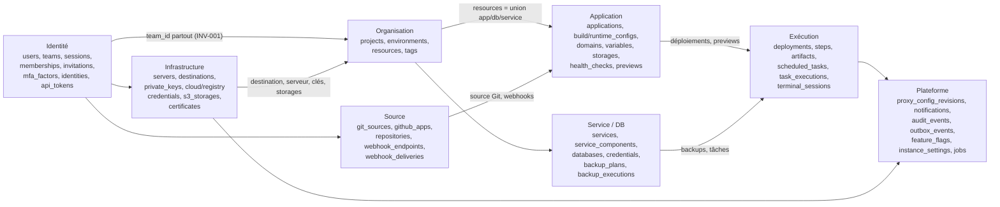
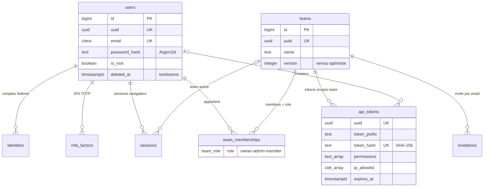
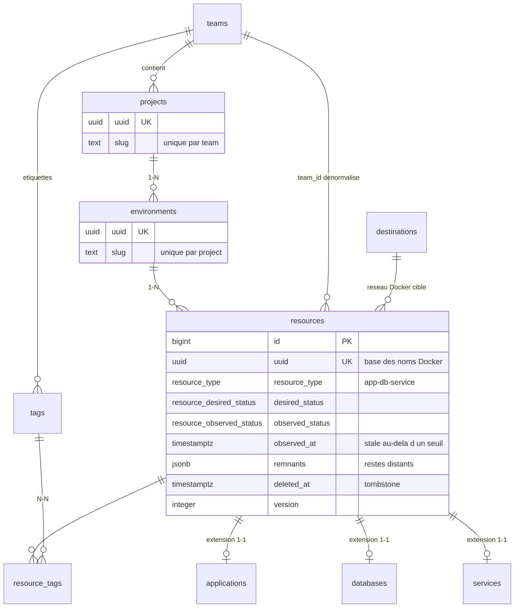
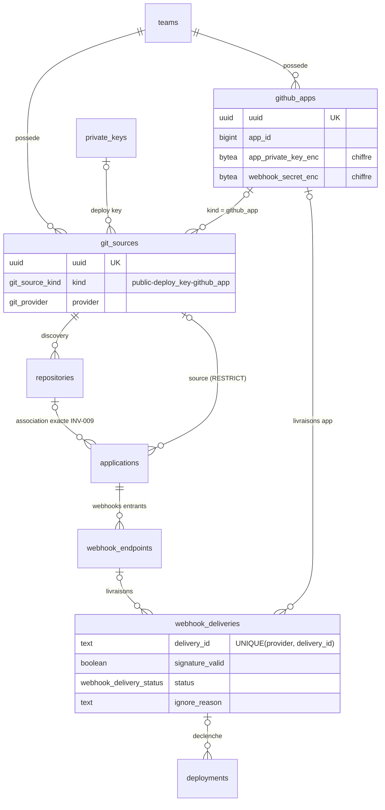
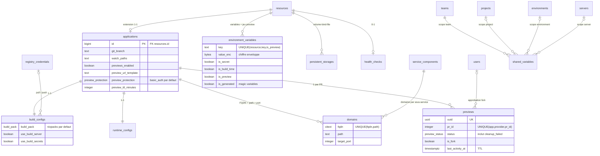
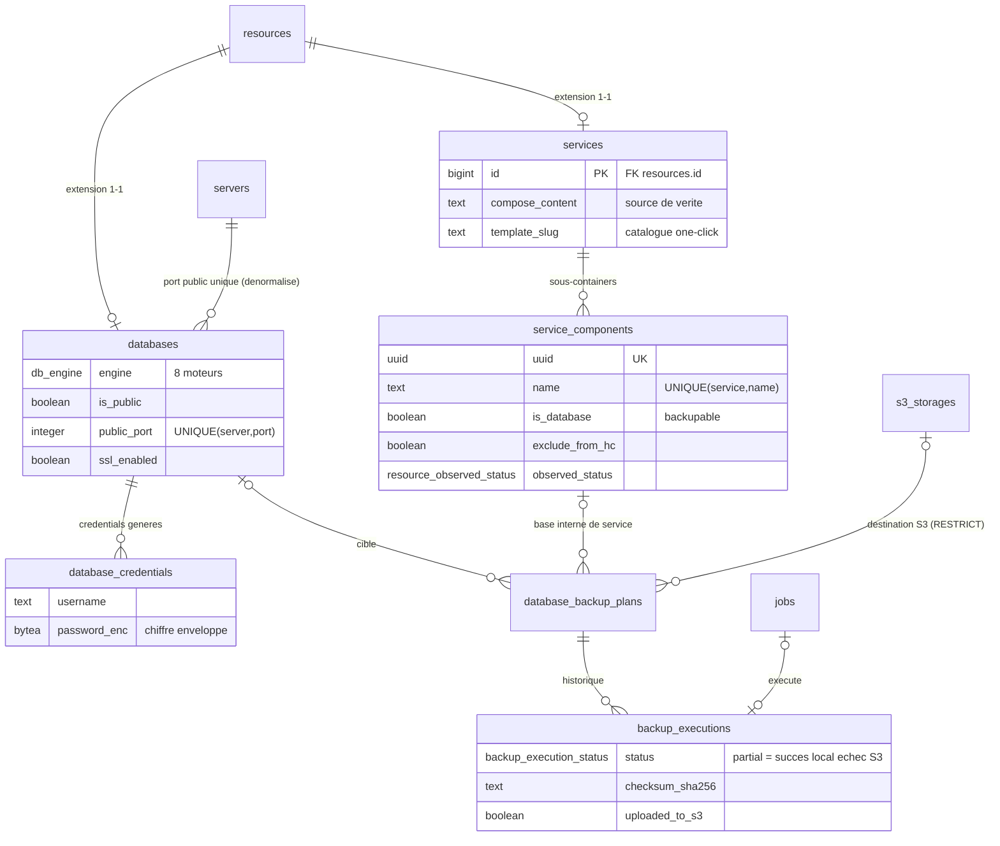
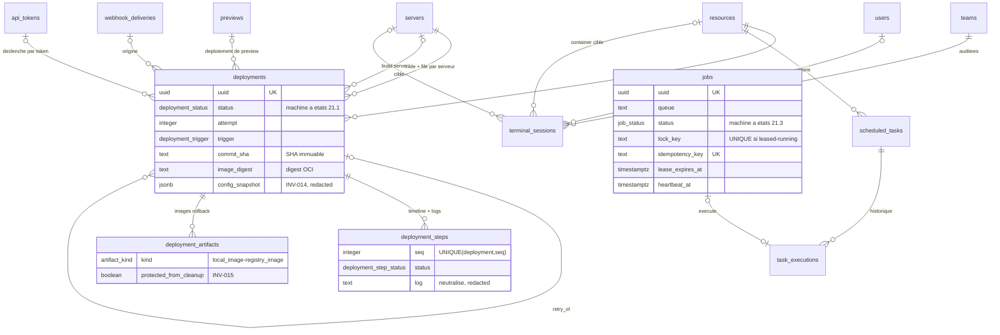

# ERD — AkerDock

> Artefact §29.2 du PRD (`docs/PRD.md`). Diagrammes entité-relation du modèle décrit dans `docs/specs/data-dictionary.md` (54 tables), suivis de l'ownership team, des contraintes d'unicité, des indexes clés et de la stratégie de migrations. Le diagramme complet étant illisible d'un bloc, il est découpé par agrégat (§19.1) avec une vue d'ensemble.

Notation : `||` = exactement 1, `|o` = 0 ou 1, `o{` = 0..N. Les entités marquées « (réf.) » appartiennent à un autre agrégat et sont répétées pour le contexte.

---

## 1. Vue d'ensemble des agrégats

---

## 2. Agrégat Identité

## 3. Agrégat Organisation

## 4. Agrégat Infrastructure

## 5. Agrégat Source

## 6. Agrégat Application

## 7. Agrégat Service / Database

## 8. Agrégat Exécution

## 9. Agrégat Plateforme

> `audit_events` et `outbox_events` n'ont volontairement **aucune FK** : ce sont des faits immuables qui référencent par UUID public et survivent à la suppression de leurs sujets (§19.2, §23.4, §24.2).

---

## 10. Ownership et isolation team (INV-001, INV-002)

Chaque table remonte à exactement une team, directement ou par chaîne parent. Le `team_id` utilisé dans les requêtes provient **toujours** du contexte authentifié (§23.1), jamais d'un paramètre client.

| Chemin vers la team | Tables |
|---|---|
| `team_id` direct | `projects`, `resources` (dénormalisé + trigger de cohérence), `servers`, `private_keys`, `cloud_credentials`, `registry_credentials`, `s3_storages`, `git_sources`, `github_apps`, `api_tokens`, `tags`, `shared_variables`, `notification_channels`, `terminal_sessions`, `invitations`, `team_memberships` |
| Via 1 parent | `environments` → `projects` ; `destinations` → `servers` ; `certificates` → `servers` ; `repositories` → `git_sources` ; `notification_rules` → `notification_channels` ; `proxy_config_revisions` → `servers` ; `applications`/`databases`/`services` → `resources` |
| Via 2+ parents | `build_configs`, `runtime_configs`, `webhook_endpoints`, `previews` → `applications` → `resources` ; `environment_variables`, `persistent_storages`, `health_checks`, `scheduled_tasks`, `deployments` → `resources` ; `service_components` → `services` → `resources` ; `database_credentials`, `database_backup_plans` → `databases` → `resources` ; `deployment_steps`, `deployment_artifacts` → `deployments` ; `backup_executions` → `database_backup_plans` ; `task_executions` → `scheduled_tasks` ; `domains` → `applications` ou `service_components` ; `resource_tags` → `resources` |
| Hors team (instance) | `users`, `identities`, `mfa_factors`, `sessions` (scopées utilisateur), `instance_settings`, `feature_flags` (`team_id` NULL = instance) |
| `team_id` nullable (résolu ou snapshot) | `webhook_deliveries` (résolue à l'association §20.3), `jobs` (jobs de maintenance sans team), `audit_events` / `outbox_events` (snapshot sans FK) |

Application de l'isolation : toute requête d'accès joint la chaîne d'ownership jusqu'à `team_id` et le compare au contexte ; un UUID valide d'une autre team produit un 404 indistinguable d'un inexistant (INV-002). La dénormalisation de `team_id` sur `resources` permet ce contrôle et la pagination sans double jointure ; sa cohérence avec `environment_id` est garantie par trigger.

---

## 11. Contraintes d'unicité

| Table | Contrainte | Justification |
|---|---|---|
| toutes | `UNIQUE (uuid)` | Identifiant public (§19.2). |
| `users` | `UNIQUE (email) WHERE deleted_at IS NULL` | Réutilisation possible après tombstone. |
| `identities` | `UNIQUE (provider, provider_subject)` | Une identité fédérée = un compte (§23.3). |
| `mfa_factors` | `UNIQUE (user_id, type)` | Un facteur TOTP par utilisateur. |
| `sessions`, `api_tokens`, `invitations` | `UNIQUE (token_hash)` | Lookup O(1) par hash. |
| `team_memberships` | `UNIQUE (team_id, user_id)` | Une appartenance par couple. |
| `invitations` | `UNIQUE (team_id, email) WHERE accepted_at IS NULL AND revoked_at IS NULL` | Une invitation active à la fois. |
| `projects` | `UNIQUE (team_id, slug) WHERE deleted_at IS NULL` | Slugs uniques dans le parent (§19.2). |
| `environments` | `UNIQUE (project_id, slug) WHERE deleted_at IS NULL` | Idem. |
| `resources` | `UNIQUE (environment_id, name) WHERE deleted_at IS NULL` | Nom unique par environnement. |
| `tags` | `UNIQUE (team_id, name)` | — |
| `servers` | `UNIQUE (team_id, name) WHERE deleted_at IS NULL` | — |
| `destinations` | `UNIQUE (server_id, network)` ; `UNIQUE (server_id) WHERE is_default` | Noms Docker uniques par destination (§19.2) ; une destination par défaut. |
| `certificates` | `UNIQUE (server_id, kind, main_domain)` | Un reflet observé par certificat servi sur le serveur. |
| `private_keys` | `UNIQUE (team_id, fingerprint_sha256)` | Anti-doublon de clé. |
| `cloud_credentials`, `registry_credentials`, `s3_storages`, `git_sources`, `notification_channels` | `UNIQUE (team_id, name)` | Nommage stable par team. |
| `github_apps` | `UNIQUE (team_id, app_id)` | Une app GitHub enregistrée une fois par team. |
| `repositories` | `UNIQUE (git_source_id, external_id)` | Association webhook exacte (INV-009). |
| `webhook_endpoints` | `UNIQUE (application_id, provider)` | Un endpoint par provider et par app. |
| `webhook_deliveries` | `UNIQUE (provider, delivery_id)` | **Déduplication des webhooks (INV-009)** — l'insert en conflit marque `duplicate`. |
| `domains` | `UNIQUE (fqdn, path)` | Routage sans ambiguïté, pas de collision inter-team. |
| `environment_variables` | `UNIQUE (resource_id, key, is_preview)` | Jeu production et jeu preview disjoints (§5.6). |
| `shared_variables` | `UNIQUE` partiel par scope (`team`/`project`/`environment`/`server` + `key`) | Une valeur par clé et par niveau (§5.4). |
| `persistent_storages` | `UNIQUE (resource_id, mount_path)` | Un montage par chemin. |
| `health_checks` | `UNIQUE (resource_id)` | 1—1. |
| `previews` | `UNIQUE (application_id, provider, pr_id)` | **Identité de preview déterministe, jamais recyclée (§20.4)**. |
| `service_components` | `UNIQUE (service_id, name)` | Noms compose uniques dans le stack. |
| `databases` | `UNIQUE (server_id, public_port) WHERE is_public` | **Réservation de port public — forte cohérence (§22.3)**. |
| `database_credentials` | `UNIQUE (database_id, username)` | — |
| `deployment_steps` | `UNIQUE (deployment_id, seq)` | Timeline ordonnée. |
| `scheduled_tasks` | `UNIQUE (resource_id, name)` | — |
| `proxy_config_revisions` | `UNIQUE (server_id, revision)` | Révisions monotones par serveur. |
| `notification_rules` | `UNIQUE NULLS NOT DISTINCT (channel_id, event_type, project_id, environment_id)` | Une règle par événement et par scope. |
| `feature_flags` | `UNIQUE NULLS NOT DISTINCT (key, team_id)` | Instance + override par team. |
| `build_configs`, `runtime_configs` | `UNIQUE (application_id)` | 1—1. |
| `jobs` | `UNIQUE (idempotency_key)` ; `UNIQUE (lock_key) WHERE status IN ('leased','running')` | **Idempotence (INV-004)** ; **verrou exclusif par ressource/serveur (§21.1 `switching`)**. |
| `instance_settings` | `CHECK (id = 1)` | Singleton. |

---

## 12. Indexes clés (justifiés par les requêtes)

| Index | Requête servie |
|---|---|
| `(team_id, id DESC)` sur `projects`, `servers`, `resources`, `api_tokens`, `private_keys`, `git_sources`, `s3_storages`, `notification_channels`… | Listes paginées par team (pagination par curseur `id`, §24.1 ; P95 < 300 ms à 50 utilisateurs, §16.4 ; 2 000 ressources/instance, §22.2). |
| `jobs (queue, priority DESC, run_at, id) WHERE status = 'queued'` | **Dequeue `SELECT … FOR UPDATE SKIP LOCKED`** : le partiel ne contient que les jobs éligibles, le tri correspond à l'ordre de consommation (§21.3, §27.2). |
| `jobs (lease_expires_at) WHERE status IN ('leased','running')` | Récupération des leases expirés par le reaper — reprise après crash (INV-013, §21.3). |
| `jobs UNIQUE (lock_key) WHERE status IN ('leased','running')` | Exclusion mutuelle deploy/switch par application/destination (§21.1) sans table de verrous séparée. |
| `webhook_deliveries UNIQUE (provider, delivery_id)` | **Déduplication à l'insert** : un replay provider devient un `ON CONFLICT` → `duplicate`, en O(1), avant tout traitement (INV-009, 1 000 livraisons/min §22.2). |
| `webhook_deliveries (received_at)`, `(status) WHERE status = 'received'` | File de traitement asynchrone (< 500 ms d'ack, §16.4) et purge de rétention. |
| `deployments (resource_id, id DESC)` | Historique paginé par ressource (100 000 déploiements, §22.2). |
| `deployments (server_id, created_at) WHERE status NOT IN ('succeeded','failed','cancelled')` | File par serveur : `concurrent_builds` / `deployment_queue_limit` (§5.5), vue « en cours/en attente ». |
| `outbox_events (id) WHERE published_at IS NULL` | Publieur outbox : lecture séquentielle des non-publiés dans l'ordre de commit (§18.2, §24.2). |
| `audit_events (team_id, occurred_at DESC)` + BRIN `(occurred_at)` | Audit paginé/filtré par team (§23.4) ; BRIN quasi gratuit sur table append-only pour la purge par rétention. |
| `resources (environment_id)`, `(destination_id)` | Prévisualisation de suppression (§20.6.1) et vérifications RESTRICT (INV-008). |
| `environment_variables (resource_id)`, `persistent_storages (resource_id)`, `domains (application_id)` / `(service_component_id)` | Chargement d'un agrégat application sans relation non bornée (§22.2). |
| `previews (application_id)`, `(last_activity_at) WHERE status = 'active'` | Plafond de previews simultanées et balayage TTL/scale-to-zero (§20.4.3). |
| `backup_executions (backup_plan_id, created_at DESC)`, `task_executions (scheduled_task_id, created_at DESC)` | Historiques paginés + application de la rétention (§7.2, §19.2). |
| `certificates (not_after)` | Alerte d'expiration J-30/J-7 (proxy-contract §7.3) et filtre `expiring_within_days` de l'API certificats. |
| `sessions (user_id)`, `(expires_at)` | Révocation par utilisateur ; purge des sessions expirées. |
| `api_tokens (token_prefix)` | Pré-filtrage du lookup Bearer avant comparaison de hash (§10.3). |

---

## 13. Stratégie de migrations (décision §27.25, §18.2)

- **Outil** : [goose](https://github.com/pressly/goose) (SQL-first, embarquable dans le binaire Go via `embed.FS`, exécuté au démarrage ou par sous-commande `AkerDock migrate`). Migrations **SQL pures versionnées** `NNNN_description.up.sql` / `NNNN_description.down.sql`, numérotation séquentielle, appliquées en transaction quand PostgreSQL le permet.
- **sqlc** : après chaque migration, `sqlc generate` régénère les types Go ; la CI échoue si le code généré n'est pas committé — le schéma, les requêtes et le code ne peuvent pas diverger (§27.25).
- **Down obligatoire** : chaque migration a un down testé en CI (up → down → up). Le down sert au développement et à la procédure de rollback de release (§26.3.6) ; en production, un downgrade suit la procédure documentée (§14.3), jamais un down automatique sur données réelles.
- **Compatibilité rolling upgrade (§18.2)** : deux versions consécutives du binaire doivent coexister sur le même schéma (multi-instance, §22.1). Pattern **expand / contract** :
  1. *Expand* (release N) : ajouts uniquement — nouvelles tables/colonnes nullable ou avec défaut, nouveaux index en `CREATE INDEX CONCURRENTLY` (hors transaction), doubles écritures si renommage.
  2. *Migrate* : backfill par lots (jamais de `UPDATE` massif verrouillant), idempotent et reprenable.
  3. *Contract* (release N+1 au plus tôt) : suppression des colonnes/chemins legacy une fois qu'aucune instance N-1 ne tourne.
- **Enums** : extension uniquement par `ALTER TYPE … ADD VALUE` (additif, sans réécriture) ; jamais de suppression de valeur — une valeur retirée du produit reste dans le type et est refusée par validation applicative. Renommer un statut = nouvelle valeur + migration de données + dépréciation.
- **Interdits en migration ordinaire** : changement de type verrouillant, `NOT NULL` sans défaut sur table volumineuse, suppression de colonne encore lue par la release précédente, index non-`CONCURRENTLY` sur table chaude.
- **Chiffrement** : la rotation de clé maître (§23.2, §27.3) n'est **pas** une migration de schéma — c'est un job applicatif qui réécrit les `*_enc` par `key_version`, par lots, sans blocage.
- **Vérifications CI** : migration up/down sur base vide + sur un dump de fixtures ; test de démarrage de la release N-1 sur le schéma N (garde rolling upgrade) ; `EXPLAIN` de non-régression sur les requêtes critiques (dequeue jobs, dédup webhooks, listes paginées).
