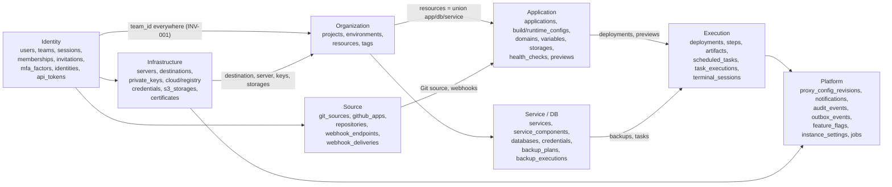
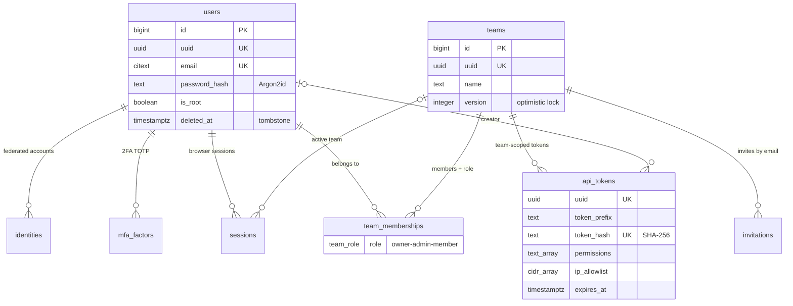
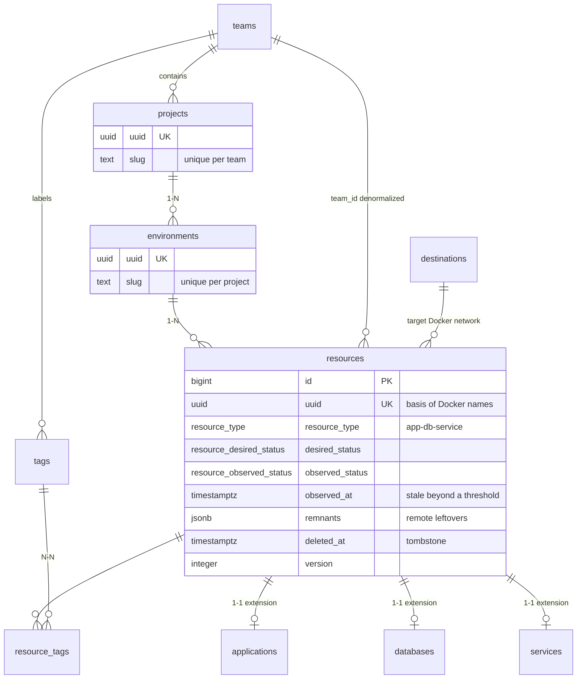
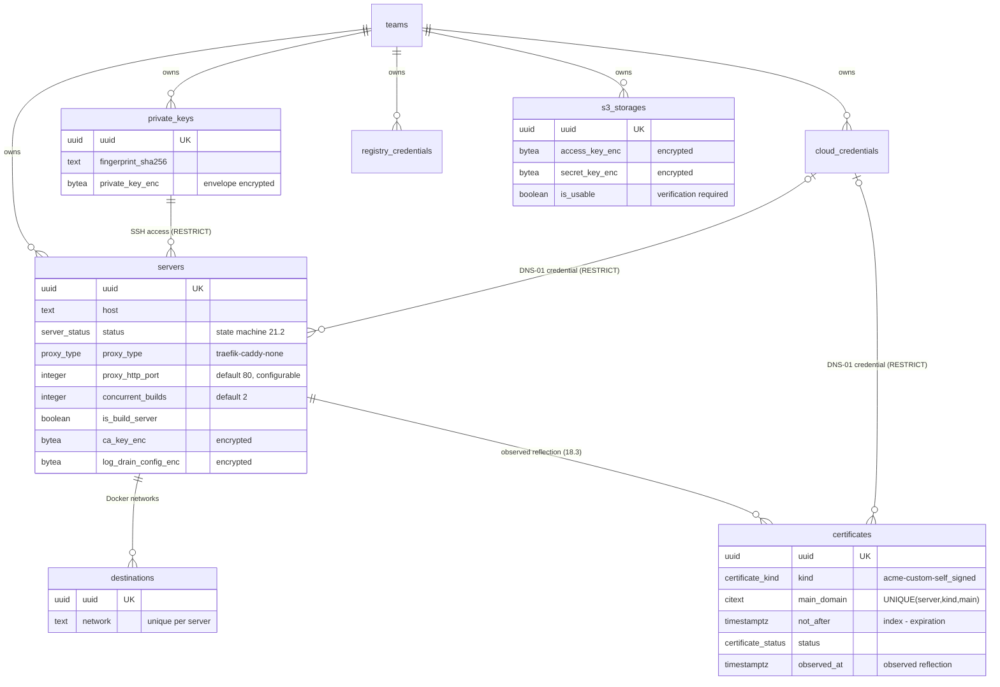
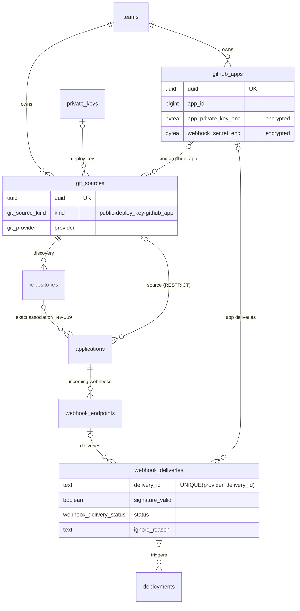
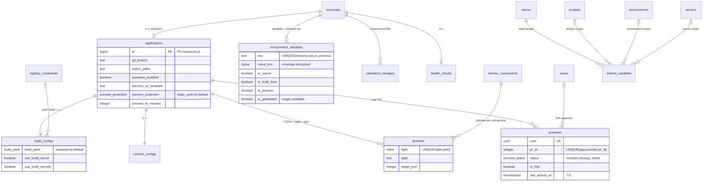
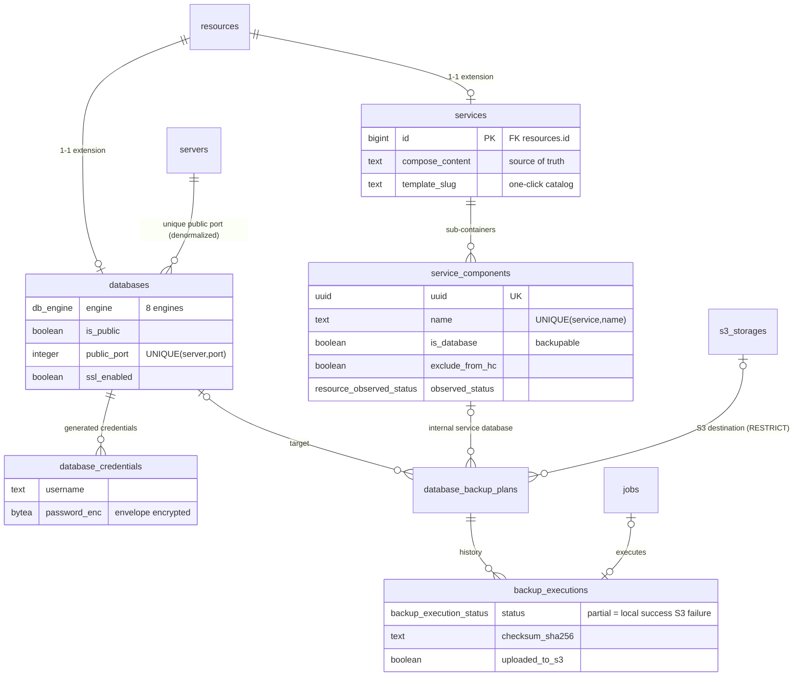
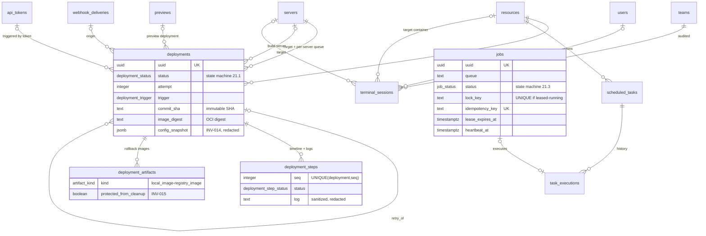
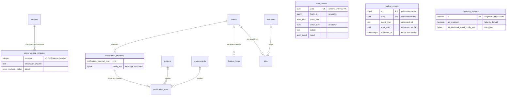

# ERD — AkerDock

> PRD §29.2 artifact (`docs/PRD.md`). Entity-relationship diagrams of the model described in `docs/specs/data-dictionary.md` (54 tables), followed by team ownership, uniqueness constraints, key indexes and the migration strategy. As the full diagram is unreadable in one block, it is split by aggregate (§19.1) with an overview.

Notation: `||` = exactly 1, `|o` = 0 or 1, `o{` = 0..N. Entities marked "(ref.)" belong to another aggregate and are repeated for context.

---

## 1. Aggregate overview

---

## 2. Identity aggregate

## 3. Organization aggregate

## 4. Infrastructure aggregate

## 5. Source aggregate

## 6. Application aggregate

## 7. Service / Database aggregate

## 8. Execution aggregate

## 9. Platform aggregate

> `audit_events` and `outbox_events` deliberately have **no FK**: they are immutable facts that reference by public UUID and survive the deletion of their subjects (§19.2, §23.4, §24.2).

---

## 10. Team ownership and isolation (INV-001, INV-002)

Every table traces back to exactly one team, directly or through a parent chain. The `team_id` used in queries **always** comes from the authenticated context (§23.1), never from a client parameter.

| Path to the team | Tables |
|---|---|
| Direct `team_id` | `projects`, `resources` (denormalized + consistency trigger), `servers`, `private_keys`, `cloud_credentials`, `registry_credentials`, `s3_storages`, `git_sources`, `github_apps`, `api_tokens`, `tags`, `shared_variables`, `notification_channels`, `terminal_sessions`, `invitations`, `team_memberships` |
| Via 1 parent | `environments` → `projects`; `destinations` → `servers`; `certificates` → `servers`; `repositories` → `git_sources`; `notification_rules` → `notification_channels`; `proxy_config_revisions` → `servers`; `applications`/`databases`/`services` → `resources` |
| Via 2+ parents | `build_configs`, `runtime_configs`, `webhook_endpoints`, `previews` → `applications` → `resources`; `environment_variables`, `persistent_storages`, `health_checks`, `scheduled_tasks`, `deployments` → `resources`; `service_components` → `services` → `resources`; `database_credentials`, `database_backup_plans` → `databases` → `resources`; `deployment_steps`, `deployment_artifacts` → `deployments`; `backup_executions` → `database_backup_plans`; `task_executions` → `scheduled_tasks`; `domains` → `applications` or `service_components`; `resource_tags` → `resources` |
| Outside team (instance) | `users`, `identities`, `mfa_factors`, `sessions` (user-scoped), `instance_settings`, `feature_flags` (`team_id` NULL = instance) |
| Nullable `team_id` (resolved or snapshot) | `webhook_deliveries` (resolved at association §20.3), `jobs` (maintenance jobs without a team), `audit_events` / `outbox_events` (snapshot without FK) |

Isolation enforcement: every access query joins the ownership chain up to `team_id` and compares it to the context; a valid UUID from another team produces a 404 indistinguishable from a nonexistent one (INV-002). The denormalization of `team_id` on `resources` enables this check and pagination without a double join; its consistency with `environment_id` is guaranteed by trigger.

---

## 11. Uniqueness constraints

| Table | Constraint | Justification |
|---|---|---|
| all | `UNIQUE (uuid)` | Public identifier (§19.2). |
| `users` | `UNIQUE (email) WHERE deleted_at IS NULL` | Reuse possible after tombstone. |
| `identities` | `UNIQUE (provider, provider_subject)` | One federated identity = one account (§23.3). |
| `mfa_factors` | `UNIQUE (user_id, type)` | One TOTP factor per user. |
| `sessions`, `api_tokens`, `invitations` | `UNIQUE (token_hash)` | O(1) lookup by hash. |
| `team_memberships` | `UNIQUE (team_id, user_id)` | One membership per pair. |
| `invitations` | `UNIQUE (team_id, email) WHERE accepted_at IS NULL AND revoked_at IS NULL` | One active invitation at a time. |
| `projects` | `UNIQUE (team_id, slug) WHERE deleted_at IS NULL` | Slugs unique within the parent (§19.2). |
| `environments` | `UNIQUE (project_id, slug) WHERE deleted_at IS NULL` | Same. |
| `resources` | `UNIQUE (environment_id, name) WHERE deleted_at IS NULL` | Unique name per environment. |
| `tags` | `UNIQUE (team_id, name)` | — |
| `servers` | `UNIQUE (team_id, name) WHERE deleted_at IS NULL` | — |
| `destinations` | `UNIQUE (server_id, network)`; `UNIQUE (server_id) WHERE is_default` | Docker names unique per destination (§19.2); one default destination. |
| `certificates` | `UNIQUE (server_id, kind, main_domain)` | One observed reflection per certificate served on the server. |
| `private_keys` | `UNIQUE (team_id, fingerprint_sha256)` | Key duplicate prevention. |
| `cloud_credentials`, `registry_credentials`, `s3_storages`, `git_sources`, `notification_channels` | `UNIQUE (team_id, name)` | Stable naming per team. |
| `github_apps` | `UNIQUE (team_id, app_id)` | A GitHub app registered once per team. |
| `repositories` | `UNIQUE (git_source_id, external_id)` | Exact webhook association (INV-009). |
| `webhook_endpoints` | `UNIQUE (application_id, provider)` | One endpoint per provider and per app. |
| `webhook_deliveries` | `UNIQUE (provider, delivery_id)` | **Webhook deduplication (INV-009)** — the conflicting insert marks `duplicate`. |
| `domains` | `UNIQUE (fqdn, path)` | Unambiguous routing, no cross-team collision. |
| `environment_variables` | `UNIQUE (resource_id, key, is_preview)` | Disjoint production and preview sets (§5.6). |
| `shared_variables` | Partial `UNIQUE` per scope (`team`/`project`/`environment`/`server` + `key`) | One value per key and per level (§5.4). |
| `persistent_storages` | `UNIQUE (resource_id, mount_path)` | One mount per path. |
| `health_checks` | `UNIQUE (resource_id)` | 1—1. |
| `previews` | `UNIQUE (application_id, provider, pr_id)` | **Deterministic preview identity, never recycled (§20.4)**. |
| `service_components` | `UNIQUE (service_id, name)` | Compose names unique within the stack. |
| `databases` | `UNIQUE (server_id, public_port) WHERE is_public` | **Public port reservation — strong consistency (§22.3)**. |
| `database_credentials` | `UNIQUE (database_id, username)` | — |
| `deployment_steps` | `UNIQUE (deployment_id, seq)` | Ordered timeline. |
| `scheduled_tasks` | `UNIQUE (resource_id, name)` | — |
| `proxy_config_revisions` | `UNIQUE (server_id, revision)` | Monotonic revisions per server. |
| `notification_rules` | `UNIQUE NULLS NOT DISTINCT (channel_id, event_type, project_id, environment_id)` | One rule per event and per scope. |
| `feature_flags` | `UNIQUE NULLS NOT DISTINCT (key, team_id)` | Instance + per-team override. |
| `build_configs`, `runtime_configs` | `UNIQUE (application_id)` | 1—1. |
| `jobs` | `UNIQUE (idempotency_key)`; `UNIQUE (lock_key) WHERE status IN ('leased','running')` | **Idempotence (INV-004)**; **exclusive lock per resource/server (§21.1 `switching`)**. |
| `instance_settings` | `CHECK (id = 1)` | Singleton. |

---

## 12. Key indexes (justified by the queries)

| Index | Query served |
|---|---|
| `(team_id, id DESC)` on `projects`, `servers`, `resources`, `api_tokens`, `private_keys`, `git_sources`, `s3_storages`, `notification_channels`… | Paginated lists per team (cursor pagination by `id`, §24.1; P95 < 300 ms at 50 users, §16.4; 2,000 resources/instance, §22.2). |
| `jobs (queue, priority DESC, run_at, id) WHERE status = 'queued'` | **Dequeue `SELECT … FOR UPDATE SKIP LOCKED`**: the partial index contains only eligible jobs, the sort matches the consumption order (§21.3, §27.2). |
| `jobs (lease_expires_at) WHERE status IN ('leased','running')` | Recovery of expired leases by the reaper — crash recovery (INV-013, §21.3). |
| `jobs UNIQUE (lock_key) WHERE status IN ('leased','running')` | Deploy/switch mutual exclusion per application/destination (§21.1) without a separate lock table. |
| `webhook_deliveries UNIQUE (provider, delivery_id)` | **Deduplication at insert**: a provider replay becomes an `ON CONFLICT` → `duplicate`, in O(1), before any processing (INV-009, 1,000 deliveries/min §22.2). |
| `webhook_deliveries (received_at)`, `(status) WHERE status = 'received'` | Asynchronous processing queue (< 500 ms ack, §16.4) and retention purge. |
| `deployments (resource_id, id DESC)` | Paginated history per resource (100,000 deployments, §22.2). |
| `deployments (server_id, created_at) WHERE status NOT IN ('succeeded','failed','cancelled')` | Per-server queue: `concurrent_builds` / `deployment_queue_limit` (§5.5), "running/pending" view. |
| `outbox_events (id) WHERE published_at IS NULL` | Outbox publisher: sequential read of unpublished events in commit order (§18.2, §24.2). |
| `audit_events (team_id, occurred_at DESC)` + BRIN `(occurred_at)` | Paginated/filtered audit per team (§23.4); BRIN nearly free on an append-only table for the retention purge. |
| `resources (environment_id)`, `(destination_id)` | Deletion preview (§20.6.1) and RESTRICT checks (INV-008). |
| `environment_variables (resource_id)`, `persistent_storages (resource_id)`, `domains (application_id)` / `(service_component_id)` | Loading an application aggregate without an unbounded relation (§22.2). |
| `previews (application_id)`, `(last_activity_at) WHERE status = 'active'` | Cap on simultaneous previews and TTL/scale-to-zero sweep (§20.4.3). |
| `backup_executions (backup_plan_id, created_at DESC)`, `task_executions (scheduled_task_id, created_at DESC)` | Paginated histories + retention enforcement (§7.2, §19.2). |
| `certificates (not_after)` | Expiration alert at D-30/D-7 (proxy-contract §7.3) and the certificates API's `expiring_within_days` filter. |
| `sessions (user_id)`, `(expires_at)` | Per-user revocation; purge of expired sessions. |
| `api_tokens (token_prefix)` | Pre-filtering of the Bearer lookup before hash comparison (§10.3). |

---

## 13. Migration strategy (decision §27.25, §18.2)

- **Tool**: [goose](https://github.com/pressly/goose) (SQL-first, embeddable in the Go binary via `embed.FS`, run at startup or via the `AkerDock migrate` subcommand). **Pure versioned SQL** migrations `NNNN_description.up.sql` / `NNNN_description.down.sql`, sequential numbering, applied in a transaction whenever PostgreSQL allows it.
- **sqlc**: after each migration, `sqlc generate` regenerates the Go types; CI fails if the generated code is not committed — the schema, the queries and the code cannot diverge (§27.25).
- **Down required**: every migration has a down tested in CI (up → down → up). The down serves development and the release rollback procedure (§26.3.6); in production, a downgrade follows the documented procedure (§14.3), never an automatic down on real data.
- **Rolling upgrade compatibility (§18.2)**: two consecutive versions of the binary must coexist on the same schema (multi-instance, §22.1). **Expand / contract** pattern:
  1. *Expand* (release N): additions only — new tables/columns nullable or with a default, new indexes via `CREATE INDEX CONCURRENTLY` (outside a transaction), double writes when renaming.
  2. *Migrate*: batched backfill (never a massive locking `UPDATE`), idempotent and resumable.
  3. *Contract* (release N+1 at the earliest): removal of legacy columns/paths once no N-1 instance is running.
- **Enums**: extension only via `ALTER TYPE … ADD VALUE` (additive, without rewrite); never a value removal — a value removed from the product stays in the type and is rejected by application-level validation. Renaming a status = new value + data migration + deprecation.
- **Forbidden in an ordinary migration**: locking type change, `NOT NULL` without a default on a large table, removal of a column still read by the previous release, non-`CONCURRENTLY` index on a hot table.
- **Encryption**: the master key rotation (§23.2, §27.3) is **not** a schema migration — it is an application job that rewrites the `*_enc` columns by `key_version`, in batches, without blocking.
- **CI checks**: migration up/down on an empty database + on a fixtures dump; startup test of release N-1 on schema N (rolling upgrade guard); non-regression `EXPLAIN` on the critical queries (jobs dequeue, webhook dedup, paginated lists).
