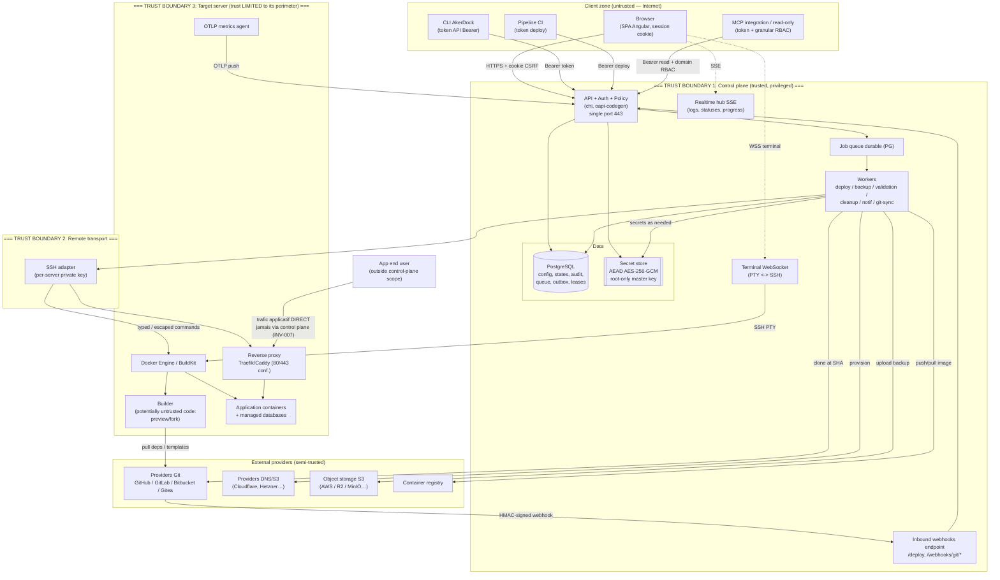

# STRIDE Threat Model — AkerDock (artifact §29.7)

> Security specification document (artifact §29.7 of the PRD, `docs/PRD.md`).
> Reference baseline: §23 (security and threat model), §17 (INV-xxx invariants),
> §16.3 (actors), §10 (auth/tokens), §20.4 (previews/forks), and the ADRs in `docs/adr/`.
>
> Methodology: STRIDE (Spoofing, Tampering, Repudiation, Information disclosure,
> Denial of service, Elevation of privilege) applied component by component, based
> on the trust boundaries described in §18.1 and §23.1.
>
> Traceability convention: each control references an invariant (`INV-xxx`), a
> §23.x subsection, an ADR decision (`ADR-0xx` / §27.x), or is marked
> **"missing"** if it remains to be implemented. Defaults proposed beyond
> parity are marked **(proposed default)**.

---

## 1. Data flow diagram and trust boundaries

### 1.1 Overview

### 1.2 Trust boundaries (summary)

| # | Boundary | Flow direction | What crosses it | Crossing control |
|---|---|---|---|---|
| TB-1 | Internet client → Control plane | inbound | API requests, SSE, terminal WS, webhooks | Auth (session/token/HMAC), RBAC policy, rate limit, validation (§23.3) |
| TB-2 | Control plane → Remote transport | outbound | deployment/lifecycle commands | typed/escaped commands (INV-012), per-server SSH key (§23.1) |
| TB-3 | Transport → Target server | bidirectional | Docker exec, logs/PTY streams, metrics | target server = trust limited to its perimeter (§16.3, §23.1) |
| TB-4 | Target server → Git/DNS/S3/registry providers | outbound | clone, push, upload, DNS-01 challenge | minimal credentials, SSRF allow/deny (§23.3), rotation (§16.3) |
| TB-5 | Builder → rest of the server/control plane | server-internal | execution of untrusted code | isolated rootless builder, without control plane credentials (ADR-005, §23.1) |
| TB-6 | Target server → End-user (application traffic) | outbound from server | application HTTP requests | outside the control plane (INV-007); never goes back up to the control plane |

**Structuring invariant**: application traffic **never** passes through the control plane (INV-007, §3.3). A compromise of a target server must not pivot to the other servers nor to the control plane (§23.1).

---

## 2. Inventory of assets and threat actors

### 2.1 Assets (by sensitivity and impact)

| Asset | Location | Sensitivity | Impact if compromised | Key controls |
|---|---|---|---|---|
| Encryption master key | Root-only file / control plane env | Critical | Decryption of all secrets | ADR-003, root-only, versioned, rotation (§23.2) |
| Server private SSH keys | `private_keys.private_key_enc` (AEAD) | Critical | Root control of all servers | Envelope encrypted, `0600` files, per-team separation (§23.1/§23.2) |
| Application secrets / env vars | `environment_variables` (envelope) | High | Customer credential leak | INV-003, `read:sensitive` required, never in logs |
| DNS-01 / S3 / registry credentials | `cloud_credentials`, `s3_storages`, `registry_credentials` | High | DNS hijacking and fraudulent certificate issuance, backup theft | Common secret store (§23.2), SSRF policy (§23.3) |
| Managed database CA (private key) | Secret store | High | MITM on DB connections | UI regeneration, dual-control rotation (§6.3, §23.4) |
| Customer source code (repos) | Ephemerally cloned on builder | High | Intellectual property leak | Isolated clone, cleanup, rootless builder (ADR-005) |
| Build images / artifacts | Registry or local server | Medium | Supply chain, poisoned rollback | OCI digest, signed release images (ADR-006, §23.5) |
| Control plane PostgreSQL database | Control plane instance | Critical | All config + hashes + audit | Encrypted/checksummed backup (§22.3), separate APP_KEY |
| Webhook secrets | `webhook_endpoints` / sources | High | Deployment forgery | HMAC + secret store (INV-009, §23.2) |
| Sessions / API tokens | `sessions.token_hash`, `api_tokens.token_hash` | High | Actor impersonation | SHA-256 hash, rotation, IP allowlist (§10.3, §23.3) |
| MFA recovery codes / TOTP secret | `mfa_factors` (hash / envelope) | High | 2FA bypass | SHA-256 hash / envelope (§23.3) |
| Backups (DB + volumes) | Local `/data` + S3 | High | Exfiltration of customer data | Encryption, remote object verification (§20.5) |
| Audit trail | `audit_events` (append-only) | Medium | Trace erasure | Append-only, exportable (§23.4) |

### 2.2 Threat agents

| Actor / threat | Motivation / capability | Position | Main targets |
|---|---|---|---|
| User of another team | Access to out-of-team resources via a valid UUID | Authenticated, other team | INV-002 (team isolation) |
| Malicious fork PR | Exfiltrate runner secrets/capabilities via untrusted code | Untrusted external contributor | INV-010, preview secrets, builder |
| Compromised target server | Pivot to other servers / control plane | Root on a target server | SSH keys of other servers, control plane |
| Hostile network / MITM | Interception, replay, injection | On the network path | TLS, webhooks, terminal, SSH |
| Insider member (low-privileged) | Elevation, access to secrets, destructive actions | Authenticated within the team | RBAC, `read:sensitive`, audit |
| Poisoned dependency / template | Supply chain via catalog or build deps | Template author / upstream maintainer | Signed catalog, rootless builder |
| Unauthenticated external attacker | Brute force, discovery, DoS | Internet | Login, public endpoints, rate limit |
| Leaked API token | Replay of the token's permissions | Token holder | Token scope, IP allowlist, expiration |

---

## 3. STRIDE analysis per component

> Columns: **Threat (STRIDE category)** → **Concrete scenario** → **Existing control** (ref. INV/§23.x/ADR) → **Missing control to implement**.

### 3.1 API + Auth + Policy

| STRIDE | Concrete scenario | Existing control | Missing control |
|---|---|---|---|
| **S** — Spoofing | Theft of a session cookie or Bearer token to impersonate an actor | Secure/HttpOnly/SameSite cookies, session rotation, tokens hashed SHA-256 + prefix, CIDR IP allowlist (§23.3, §10.3, `api_tokens`) | Session anomaly detection (new IP/UA) and optional alert **(proposed default: notification)** |
| **S** — Spoofing | A client claims someone else's address in `X-Forwarded-For` to pass a token's CIDR allowlist, forge the address in an audit record, or rotate through rate-limit buckets | The header is read **only** when the peer itself is a declared proxy (`AKERDOCK_TRUSTED_PROXIES`), and the chain is walked right-to-left past our own hops; unconfigured, no such header is read at all | — |
| **R** — Repudiation | Behind a reverse proxy, every audit entry, session row and rate-limit bucket carries the proxy's address, so no action can be attributed to a source | Same control: declaring the proxy restores the real caller address everywhere at once (one resolution, before any reader) | Startup detection of "every request comes from one private address, no trusted proxy declared" |
| **T** — Tampering | Modification of the `team_id` in the body/parameter to write into another team | `team_id` injected from the authenticated context, never from the client (§23.1, INV-002) | Systematic cross-team non-regression test on every handler (§6 tests) |
| **R** — Repudiation | An admin denies having deleted a resource | Append-only audit with actor/token, IP, UA, redacted diff (§23.4) | Cryptographic signing/chaining of audit entries **(proposed default)** |
| **I** — Information disclosure | A secret returned without the right, or in an error message | INV-003, `is_redacted`, error format without stack (§24.1), `read:sensitive` permission | CI anti-leak scanner (secret in response/log) on the OpenAPI fixtures |
| **D** — Denial of service | API flood exhausting PG/CPU | Rate limit 200 req/min per token, mandatory pagination (§22.2), opaque cursors | Per-team quotas + global backpressure; provider circuit breaker (§22.1, partially specified) |
| **E** — Elevation | Creation of a token carrying more rights than the creator | Anti-elevation guard at `createApiToken` (OpenAPI, `403` otherwise) | Formalize `tokens:create` + re-evaluation at use time (see rbac-matrix §4) **missing** |

### 3.2 Realtime / SSE (logs, statuses, progress)

| STRIDE | Concrete scenario | Existing control | Missing control |
|---|---|---|---|
| **S** | Listening to another team's log stream via a guessed deployment UUID | Stream protected by the same policy as the equivalent REST endpoint (§24.4), INV-002 | Realtime token bound to the resource and single-use (§24.4) — **to be implemented** |
| **T** | Injection of ANSI/HTML sequences into displayed logs (log poisoning) | ANSI/HTML neutralization, neutralized HTML rendering (§5.7, §23.3) | Log display fuzzing tests |
| **R** | Log consumption without a trace | Audit of sensitive accesses (§23.4) | Reads of non-sensitive logs are not audited (accepted choice) |
| **I** | A secret printed by the build leaks into the log stream | INV-003 (no secret in logs), Docker build secrets BuildKit (§5.4) | On-the-fly filtering/redaction of known secret patterns in the stream **(proposed default)** |
| **D** | Thousands of open SSE streams saturating connections | Bounded buffer, backpressure, cursor, dropped-lines signal (§22.2); target 500 streams (§22.2) | Explicit cap of concurrent streams per team/user **missing** |
| **E** | Reuse of a realtime token for another stream | Short-lived token, revocation on close (§24.4) | Strict token→(resource, stream type) binding **to be implemented** |

### 3.3 WebSocket terminal (PTY → SSH)

| STRIDE | Concrete scenario | Existing control | Missing control |
|---|---|---|---|
| **S** | Hijacking of an open terminal session (attach token theft) | **Single-use** token consumed atomically in SQL (`WHERE claimed_at IS NULL RETURNING` — a replay matches no row), TTL 60 s, hash only in database; issued by an authenticated operation bounded to the team (§10.4, §24.4) | Binding of the token to the connection fingerprint **(proposed default)** — the token travels in the query string since no header is possible on a browser WebSocket |
| **T** | Command injection via resize/escape sequences | Resize bounded (1–1000 columns/rows) and parsed server-side, never re-injected into a shell; rendering is delegated to xterm.js (§23.3, §24.4) | Fuzzing of terminal control sequences (§23.5) |
| **R** | Destructive actions in a root terminal not attributable | Opening **and** closing audited, with the end reason (§24.4, §23.4) | Keystrokes not recorded by default (privacy choice §24.4); opt-in regulatory mode **(proposed default: off)** |
| **I** | Capture of secrets typed at the keyboard in the logs | Keystrokes not recorded (§24.4) — the bridge moves bytes, it retains none; proven E2E (no keystroke in the audit table) | — (compliant) |
| **D** | Terminal sessions left open indefinitely | Idle timeout (**output** does not count as activity) and configurable max duration, guaranteed pty kill on disconnect/expiration; sweep of orphaned rows after a control plane crash (§24.4); **cap of concurrent sessions per team** (still-claimable tokens count) | — (compliant) |
| **E** | Opening a root terminal without the right / on another team | Team isolation (another team receives `404`, never `403`); container terminal = `write` permission; **server** terminal = root terminal: **dual control** — recent passkey step-up for a browser session, `root` permission for an API token (rbac §5, §10.4) | — (compliant; step-up relies on the passkey, TOTP MFA still to come) |

### 3.3bis Local CLI: login and TCP tunnel (ADR-031, ADR-032)

| STRIDE | Concrete scenario | Existing control | Missing control |
|---|---|---|---|
| **S** | Phishing of the consent page: an attacker pushes the victim to approve *their* login request | The **confirmation code** is generated by the CLI and displayed on both sides; the user must compare `user_code` terminal ↔ browser before approving (ADR-031); approval via POST+CSRF under a session | Notification to the user when a new CLI token is minted **(proposed default)** |
| **T** | Interception of the authorization code (URL, history, proxy logs) to obtain a token | **PKCE**: the token is only delivered at the exchange verifying `SHA-256(verifier)==challenge`; the `verifier` never leaves the CLI process; single-use hashed code, TTL 10 min (ADR-031) | — (compliant) |
| **R** | Impossible to attribute the issuance of a CLI token | `start`/`approve`/`token` audited (actor, IP, team, permissions), token named `cli — <user>@<host>`, listed and revocable (§23.4, ADR-031) | — (compliant) |
| **I** | Token leak at rest on the workstation | `~/.akerdock/credentials.yaml` file with `0600`, TTL 30 d, revocable | OS keychain — **SHOULD v1.x**, accepted gap (static binary ADR-021, ADR-031) instead of the keychain "proposed default" |
| **D** | Tunnels left open / saturation | Single-use attach token TTL 60 s, idle 15 min, max duration 4 h, heartbeat, guaranteed teardown, **per-team cap** `port_forward_limit`, 32 streams/session (ADR-032) | — (compliant) |
| **E** | Tunnel/shell to a container of another team or unauthorized | Token minting constrained to the session's permissions (⊆); opening a port-forward = `write` on the resource; team isolation (`404`); target **frozen and authorized at mint time** (ADR-032) | Boundary at the granularity of the **resource, not the port** — accepted and documented (cf. terminal `docker exec`) |

### 3.4 SSH workers (remote transport)

| STRIDE | Concrete scenario | Existing control | Missing control |
|---|---|---|---|
| **S** | MITM on the SSH connection to a server (bad host key) | Host key/SSH policy verification at onboarding (§20.1), distinct error on bad host key (§20.1 acceptance) | Strict pinning + alert on host key change **(proposed default)** |
| **T** | Shell injection via user input (domain, custom docker options) passed to a remote command | INV-012 (typed/escaped arguments, centralized lib), centralized validation (§23.3) | Systematic parser fuzzing + shell injection tests (§23.5) **to be completed** |
| **R** | Impossible to attribute a remote command to an actor | Audit of server changes, correlation ID (§23.4) | — (compliant) |
| **I** | A team's SSH key used for another team's server | Per-team key selection, membership verified (INV-002, §23.2), another team's key rejected (§20.1) | — (compliant) |
| **D** | An unreachable server blocks the workers | Timeout, cancellation, bounded retry with jitter, circuit breaker (§22.1) | — (compliant, to be tested) |
| **E** | A compromised target server exfiltrates the SSH key and pivots | Keys separable per server, secrets on a strict need basis, one server ≠ access to the others (§23.1) | Outbound pull agent target to reduce the surface (ADR-001) — **future** |

### 3.4bis Server agent: outbound observation push (ADR-040)

The helper (waker mode) POSTs observation batches to `/agent/v1/observations`, authenticated by a per-server token (`agent_tokens`, SHA-256 hash) injected over SSH at container creation. Observations are hints, never actions.

| STRIDE | Concrete scenario | Existing control | Missing control |
|---|---|---|---|
| **S** | A stolen agent token impersonates the server's helper | Token scoped to ONE server; every effect query carries the token's `server_id` in SQL — out-of-scope resources are unreachable by construction; rotation by recreation (helper recreate re-mints on row deletion) | Automatic periodic rotation **(proposed default)** |
| **T** | Forged observations flip another server's states (fake `stz_woken`, fake container states) | Server-scoped queries (`GetSleepingPreviewForServer`, `WakeSleptApplicationForServer`, `SetServiceComponentObservedByName` all JOIN on the token's server); observations refresh observed state only — deploys, sleeps and secrets are untouched; SSH scans remain the authoritative reconciliation | — (compliant) |
| **R** | Untraceable state changes from agent input | Ingestion logs each effect with server id; `last_seen_at` on the token row | Per-effect audit trail entries **(proposed default)** |
| **I** | Token disclosure via the run command (`docker inspect` on the server) | The token is server-local by design: whoever can inspect containers on the server already holds its Docker socket — root-equivalent on that server, which the token's scope cannot exceed | — (accepted, documented) |
| **D** | An agent floods ingestion | 300 req/min per token, 1 MiB body cap, ≤500 observations per batch; the agent itself batches (≤100) with a bounded drop-oldest queue | — (compliant) |
| **E** | Observations escalate into actions | The endpoint can only refresh observed statuses and emit SSE events; no mutation of desired state, no reads returned (write-only surface); phase 2 (commands) deliberately out of scope (ADR-040) | — (compliant) |

### 3.5 Builders (BuildKit, untrusted code)

| STRIDE | Concrete scenario | Existing control | Missing control |
|---|---|---|---|
| **S** | A build impersonates the control plane to call the API | Builder isolated from control plane credentials (§23.1) | Builder ↔ control plane network segmentation **to be implemented** |
| **T** | A Dockerfile mounts the Docker socket and tampers with other containers | Isolation of the global Docker socket when possible (§23.1) | Dedicated rootless BuildKit builders **mandatory for untrusted code** (ADR-005 / §27.5) — **to be implemented at the latest with approved forks** |
| **R** | A malicious build erases its traces | Structured build logs retained (§20.2), deployment audit (§23.4) | — (compliant) |
| **I** | Exfiltration of build secrets via image metadata | Docker Build Secrets BuildKit (`--secret`, outside metadata) (§5.4) | Refuse build args for sensitive secrets by default **(proposed default)** |
| **D** | Infinite build / fork bomb saturating the server | Resource limits, build slots (`concurrent_builds`), timeouts (§5.5, §22.2) | Effective application of limits to untrusted builds (cgroups) **to be verified** |
| **E** | Builder escape to the host (container escape) | Rootless builder (ADR-005), network isolation (§23.1) | microVM/VM for public previews (§23.1 "reinforced isolation") **(proposed default, future)** |

### 3.6 Reverse proxy (Traefik/Caddy)

| STRIDE | Concrete scenario | Existing control | Missing control |
|---|---|---|---|
| **S** | An attacker registers a domain impersonating an existing app | Deterministic config generation + validation + checksum (§18.3), unique Docker names (INV-011) | Cross-team domain collision detection **to be verified** |
| **T** | Manual modification of the proxy config bypassing the active app | Atomic application + rollback, proxy config revision (`ProxyConfigRevision`, §18.1) | Reconciliation that restores the managed config on drift (INV-015) |
| **R** | Untracked proxy change | Audit of server/proxy changes (§23.4) | — (compliant) |
| **I** | Leak of labels containing secrets | Secrets never in labels (INV-003), fixed system labels (§5.3) | Anti-secret validation in custom labels **(proposed default)** |
| **D** | Proxy shutdown cutting all inbound traffic | Explicit warning before shutdown (§4.1), INV-007 (control plane independence) | — (documented behavior) |
| **E** | Custom docker options/labels mounting capabilities (`--cap-add`, `--privileged`) | Centralized validation of custom Docker options (§23.3, INV-012) | Strict allowlist of options authorized per role **to be implemented** |
| **E** | An over-broad auth-wall exception unintentionally publishes protected endpoints | ADR-049/050: absolute paths, explicit methods, only exact/whole-segment template/segment-bounded prefix modes, no regex/globs; per-component ownership for Compose; the same narrow rule is inherited by previews; proxy priority cannot shadow a more specific resource route; invalid stored policy fails closed; audited configuration diff | The application remains responsible for authenticating/verifying the webhook payload itself (for example HMAC) — documented boundary |

### 3.7 Inbound webhooks (Git, CI)

| STRIDE | Concrete scenario | Existing control | Missing control |
|---|---|---|---|
| **S** | Forging a webhook event without the secret | Verified HMAC signature + timestamp (INV-009, §20.3), secret store (§23.2) | — (compliant) |
| **T** | Payload modified to target another resource/branch | Exact provider/installation/repo/branch/PR association to a resource of the same team (INV-009, §20.3) | — (compliant) |
| **R** | Denial of a deployment trigger | Delivery persistence, audit of webhook calls (§23.4, §13) | — (compliant) |
| **I** | Repo with a prefix name impersonating a legitimate repo | Exact repository association (INV-009), "prefix-named repo" scenario tested (§23.5) | — (covered by §23.5 tests) |
| **D** | Webhook flood (1000/min burst) | Size limit, fast 2xx response then async, lossless queueing (§20.3, §22.2) | Rate limit per source/IP **(proposed default)** |
| **E** | Replay of a delivery to re-trigger a deployment | Deduplication by provider + delivery ID (INV-009, §20.3.2) | — (compliant, tested §23.5) |

### 3.8 Previews (PR / forks)

| STRIDE | Concrete scenario | Existing control | Missing control |
|---|---|---|---|
| **S** | A fork PR impersonates a trusted contributor | Scoped deployments (members/collaborators by default), forks ignored by default (§5.6, INV-010) | — (compliant) |
| **T** | PR code modifies the production config | Separate preview variables, per-instance isolated network/volumes (§20.4, §5.6) | — (compliant) |
| **R** | Preview triggered without an approval trace | Manual maintainer approval for forks, audited (§20.4.8, §23.4) | Explicit logging of the approving actor **to be confirmed** |
| **I** | **Fork PR exfiltrating production secrets** | INV-010 (no prod secrets), dedicated preview variable set, isolated builder with no secret injected (§20.4.8) | Rootless builder/microVM mandatory for approved forks (ADR-005) — **to be implemented** |
| **D** | Massive PR opening creating previews without limit | Preview cap per app/server + queue, inactivity TTL, scale-to-zero (§20.4.3) | Effective application of the caps **to be implemented** (P2 divergence) |
| **E** | Public preview indexed/accessible without control | Protection by default (basic auth/signed link) + `X-Robots-Tag: noindex` (§20.4.4) | Public exposure = explicit per-app choice (compliant) |

### 3.9 Secret store

| STRIDE | Concrete scenario | Existing control | Missing control |
|---|---|---|---|
| **S** | An unauthorized component requests a secret | Internal `SecretStore` interface, worker access on a strict need basis (ADR-003, §23.1) | Fine-grained authorization per caller/scope **to be formalized** |
| **T** | Tampering of an encrypted secret without detection | AEAD AES-256-GCM (authenticated) detects tampering (ADR-003, §23.2) | — (compliant) |
| **R** | Untracked secret mutation | Audit of secret mutations (§23.4) | — (compliant) |
| **I** | Theft of the encrypted blob without the master key | External/root-only master key, versioned envelope encryption (§23.2, ADR-003) | External KMS/HSM support (ADR-003: on demand) — **future** |
| **D** | Secret store unavailability blocks deployments | Secrets in PG (same availability as the rest) (ADR-002/003) | — (compliant) |
| **E** | Key rotation exposing a plaintext window | Rotation without blocking rewrite, key version (§19.2, §23.2) | Tested rotation procedure (runbook §29.10) **to be written** |

### 3.10 Template catalog

| STRIDE | Concrete scenario | Existing control | Missing control |
|---|---|---|---|
| **S** | Template impersonating an official service | Signed + validated project catalog, distinct user repos (ADR-010, §27.10) | Clear display of provenance (official vs team) **(proposed default)** |
| **T** | **Malicious one-click template** injects a hostile compose | Validation at import, versioned/signed catalog (ADR-010), compose parser validation (§23.3/§23.5) | Validation sandbox + scan of dangerous options before deployment **to be implemented** |
| **R** | Untraceable template origin | Versioned catalog, per-repo provenance (ADR-010) | Audit of template import **(proposed default)** |
| **I** | Template exfiltrating generated magic variables/secrets | Magic variables scoping per stack (§9), INV-003 | Review of `content:`/`command:` before execution **to be implemented** |
| **D** | Template deploying unlimited resources | Resource limits, quotas (§22.2, ADR-015) | Per-template/team limits **(proposed default)** |
| **E** | Template with `--privileged`/host mount escalating | Centralized validation of Docker options (§23.3, INV-012) | Options allowlist + refusal of sensitive host mounts by default **to be implemented** |

### 3.11 CLI / config-as-code

| STRIDE | Concrete scenario | Existing control | Missing control |
|---|---|---|---|
| **S** | Theft of the CLI token stored in plaintext on a workstation | Token hashed server-side, IP allowlist, expiration (§10.3) | Secure storage on the CLI side (keychain) **(proposed default)** |
| **T** | YAML apply modifying resources outside the authorized perimeter | Apply evaluated with the actor's permissions, optimistic versioning, dry-run/diff (§24.5, §24.1) | RBAC verification per targeted resource within the apply **to be implemented** |
| **R** | Untracked apply | Apply audited like any mutation, visible job (§24.5) | — (compliant) |
| **I** | Inline secrets in the YAML export | Secrets referenced (name+version), never inline (§24.5, INV-003) | — (compliant) |
| **D** | Massive apply saturating the workers | Executed as a visible job with steps/cancellation (§24.5, §22.5) | Apply size limit **(proposed default)** |
| **E** | Apply creating an elevated token/role (local `akerdock up`) | Local deployment flagged, never auto-deploy (§27.18) | Anti-elevation guard also applied via config-as-code (see rbac §4) **to be implemented** |

---

## 4. The 10 priority abuse scenarios (kill chains)

> Format: objective → short kill chain → invariant/mitigation facing it.

### AB-01 — Fork PR exfiltrating production secrets
**Kill chain**: external contributor opens a PR from a fork → CI/preview builds the untrusted code → the code reads `env` and POSTs to an external server.
**Mitigation**: forks ignored by default (INV-010, §5.6); fork preview only on maintainer approval, isolated rootless builder, **no prod secrets injected** (§20.4.8, ADR-005); dedicated preview variable set (§20.4).
**Status**: mandatory rootless builder = **to be implemented** (ADR-005); otherwise compliant by default.

### AB-02 — Access to another team's resource via a valid UUID
**Kill chain**: a member obtains the UUID of another team's server/key/resource → uses it in an API request.
**Mitigation**: INV-002 — `team_id` from the authenticated context, never from the client (§23.1); `not_found` response (not `403`, no oracle). Cross-team matrix tested (§23.5, rbac §6).

### AB-03 — Shell injection via custom docker options / domains
**Kill chain**: a user enters `--label x; rm -rf /` (or a forged domain) → concatenated into a remote SSH command.
**Mitigation**: INV-012 — typed arguments or escaping via a tested centralized lib; centralized validation of Docker options/domains/CIDR/cron (§23.3); shell injection tests + fuzzing (§23.5).

### AB-04 — Webhook replay to re-trigger a deployment
**Kill chain**: hostile network captures a signed webhook delivery → replays it.
**Mitigation**: INV-009 — HMAC signature + timestamp + deduplication by provider + delivery ID (§20.3); replay scenario tested (§23.5).

### AB-05 — Malicious one-click template
**Kill chain**: team registers a template repo → template contains `privileged: true` + bind mount `/` → deployment escalates on the host.
**Mitigation**: validation at import + signed catalog (ADR-010); centralized validation of Docker options (INV-012, §23.3); **missing**: options allowlist + refusal of sensitive host mounts by default.

### AB-06 — Terminal session theft (root)
**Kill chain**: attacker obtains a terminal attach token → replays the WS connection.
**Mitigation**: the replay **cannot succeed** — the token is consumed atomically in SQL at first attach (`WHERE claimed_at IS NULL RETURNING`), so a second use matches no row whatever the race; TTL 60 s, hash only in database (§23.2, §24.4). Session bounded to the active team (§10.4); idle timeout + guaranteed pty kill (§24.4); opening/closing audited with the reason (§23.4). Root terminal = dual control (rbac §5: passkey step-up or `root` token). Verified E2E: replay and forged token return `401`.

### AB-07 — Compromised target server pivoting to the others
**Kill chain**: attacker obtains root on a server → looks for the SSH key to reach other servers/control plane.
**Mitigation**: §23.1 — keys/credentials **separable per server**, secrets distributed on a strict need basis, one compromised server ≠ access to the others; INV-007 (control plane off the path); pull agent target (ADR-001) to reduce the inbound surface.

### AB-08 — Privilege elevation via token creation
**Kill chain**: a `write` actor creates a `root`/`deploy` token they do not hold, then uses it.
**Mitigation**: anti-elevation guard at `createApiToken` — a token cannot create a token carrying permissions it does not hold (OpenAPI, `403`); formalized as `tokens:create` + re-evaluation at use time: token = (token perms) ∩ (creator's RBAC perms) (rbac §4).

### AB-09 — Secret leak via logs / error messages
**Kill chain**: a deployment fails → the full command with a secret is returned in the error or the build log.
**Mitigation**: INV-003 — never a secret in logs/events/errors; error format without the sensitive command (§24.1); ANSI/HTML neutralization (§23.3); Docker Build Secrets (§5.4). **Missing**: on-the-fly redaction in the stream + CI scanner.

### AB-10 — SSRF via Git/registry/webhook/uptime URL to cloud metadata
**Kill chain**: a user configures a Git source, registry or uptime check pointing to `http://169.254.169.254/` → the worker fetches and leaks cloud credentials or scans the control plane's network.
**Mitigation**: §23.3 — allow/deny policy on Git/registry/S3/webhook/proxy and uptime targets, **cloud metadata/link-local blocked by default**; centralized URL validation. Uptime HTTP/TCP probes and user-controlled HTTP fetches enforce the policy on the resolved address at connection time, including redirects and DNS rebinding.

---

## 5. Assumptions and explicit out-of-scope

### 5.1 Trust assumptions
- The control plane, its root administrators and anyone with a root terminal are **highly privileged** and trusted (§23.1). The model does not protect against a malicious instance root.
- The encryption master key is properly protected by the operator (root-only file / orchestrator secret) — its compromise is outside application control (§23.2, ADR-003).
- PostgreSQL and its internal network are within the control plane's trust perimeter (§18.1).
- Git/cloud/S3 providers honor their signature and authentication contracts; their own compromise is handled by credential rotation (§16.3), not by this model.

### 5.2 Explicit out-of-scope
- **OS hardening of target servers**: the user's responsibility (§10.4). Docker bypasses UFW; the cloud provider's firewall is recommended (§10.4). AkerDock does not audit the OS configuration.
- **Volumetric / network DoS (L3/L4)**: outside the application perimeter; belongs to upstream infrastructure (CDN, provider anti-DDoS). The model covers application-level DoS (rate limit, backpressure, quotas).
- **Physical security** of the servers and the control plane host: out of scope.
- **Security of customer application workloads themselves**: AkerDock deploys standard Docker; the security of customer application code is the customer's responsibility (§16.1). Application traffic never transits through the control plane (INV-007).
- **Docker Swarm / multi-server HA**: experimental/deprecated (§3.5, ADR-004), not covered by priority hardening.
- **ARM64, systemd, real reboots, full disks, firewalls**: not covered by E2E automation (Docker-in-Docker only); residual risk accepted and documented (§27.26, ADR-026).

---

## 6. Traceability to the mandatory security tests (§23.5)

| Threat covered | Required test (§23.5) | Abuse scenario |
|---|---|---|
| Team isolation | Cross-team matrix on every endpoint and indirect relation | AB-02 |
| Injection | Parser fuzzing (Compose, env, cron, domains, ports, docker options) + shell injection tests | AB-03, AB-05 |
| Webhooks | Replay, bad signature, prefix-named repo, fork, large payload, out-of-order | AB-01, AB-04 |
| Concurrency | Double deploy, delete during deploy, key rotation during job, double restore | (§21, §22.3) |
| Supply chain | SAST, dependency/container scanning, SBOM, signed images | AB-05, AB-09 |
| Elevation via token | (to be added §23.5) dedicated token creation anti-elevation test | AB-08 |
| SSRF | Cloud metadata/link-local/private IPv4+IPv6 blocked at connection time; proxy/custom-dial and NAT64/6to4 bypass tests | AB-10 |

> Recommendation: explicitly add to the §23.5 list the remaining missing family — **elevation via token creation** (AB-08). Metadata SSRF (AB-10) is now a mandatory tested family above.
