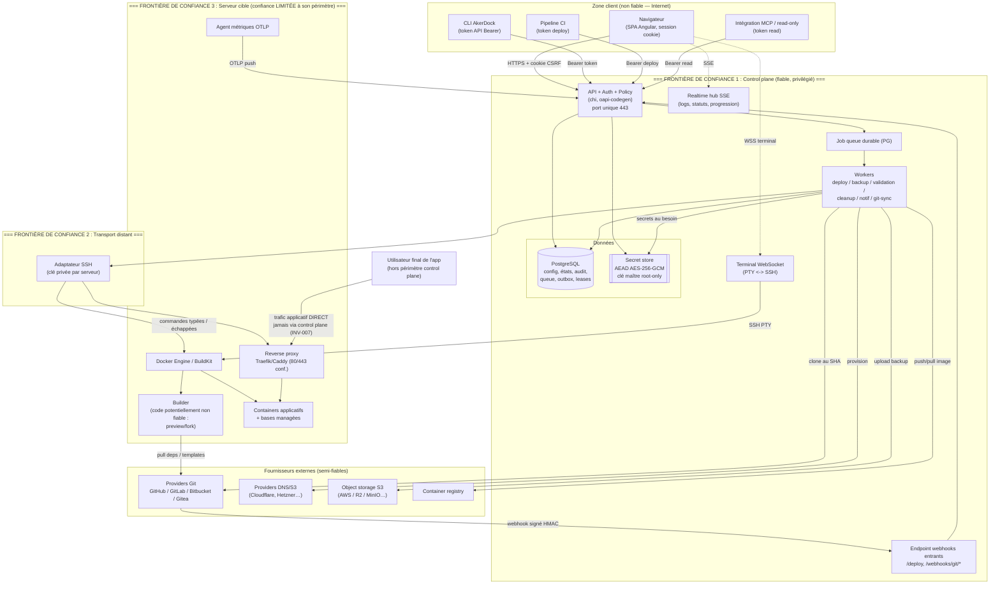

# Threat Model STRIDE — AkerDock (artefact §29.7)

> Document de spécification sécurité (artefact §29.7 du PRD, `docs/PRD.md`).
> Base de référence : §23 (sécurité et modèle de menace), §17 (invariants INV-xxx),
> §16.3 (acteurs), §10 (auth/tokens), §20.4 (previews/forks), et les ADR de `docs/adr/`.
>
> Méthodologie : STRIDE (Spoofing, Tampering, Repudiation, Information disclosure,
> Denial of service, Elevation of privilege) appliqué composant par composant, sur la
> base des frontières de confiance décrites en §18.1 et §23.1.
>
> Convention de traçabilité : chaque contrôle référence un invariant (`INV-xxx`), une
> sous-section §23.x, une décision ADR (`ADR-0xx` / §27.x), ou est marqué
> **« manquant »** s'il reste à implémenter. Les défauts proposés au-delà de la
> parité sont marqués **(défaut proposé)**.

---

## 1. Diagramme de flux de données et frontières de confiance

### 1.1 Vue d'ensemble

### 1.2 Frontières de confiance (résumé)

| # | Frontière | Direction du flux | Ce qui la traverse | Contrôle de passage |
|---|---|---|---|---|
| TB-1 | Client Internet → Control plane | entrant | requêtes API, SSE, WS terminal, webhooks | Auth (session/token/HMAC), policy RBAC, rate limit, validation (§23.3) |
| TB-2 | Control plane → Transport distant | sortant | commandes de déploiement/lifecycle | commandes typées/échappées (INV-012), clé SSH par serveur (§23.1) |
| TB-3 | Transport → Serveur cible | bidirectionnel | exec Docker, flux logs/PTY, métriques | serveur cible = confiance limitée à son périmètre (§16.3, §23.1) |
| TB-4 | Serveur cible → Fournisseurs Git/DNS/S3/registry | sortant | clone, push, upload, challenge DNS-01 | credentials minimaux, allow/deny SSRF (§23.3), rotation (§16.3) |
| TB-5 | Builder → reste du serveur/control plane | interne au serveur | exécution de code non fiable | builder rootless isolé, sans credentials control plane (ADR-005, §23.1) |
| TB-6 | Serveur cible → End-user (trafic applicatif) | sortant du serveur | requêtes HTTP applicatives | hors control plane (INV-007) ; ne remonte jamais au control plane |

**Invariant structurant** : le trafic applicatif ne passe **jamais** par le control plane (INV-007, §3.3). Une compromission d'un serveur cible ne doit pas pivoter vers les autres serveurs ni vers le control plane (§23.1).

---

## 2. Inventaire des assets et des acteurs/menaces

### 2.1 Assets (par sensibilité et impact)

| Asset | Localisation | Sensibilité | Impact si compromis | Contrôles clés |
|---|---|---|---|---|
| Clé maître de chiffrement | Fichier root-only / env du control plane | Critique | Déchiffrement de tous les secrets | ADR-003, root-only, versionnée, rotation (§23.2) |
| Clés SSH privées serveurs | `private_keys.private_key_enc` (AEAD) | Critique | Contrôle root de tous les serveurs | Chiffré enveloppe, fichiers `0600`, séparation par team (§23.1/§23.2) |
| Secrets applicatifs / env vars | `environment_variables` (enveloppe) | Élevée | Fuite credentials clients | INV-003, `read:sensitive` requis, jamais dans logs |
| Credentials DNS-01 / S3 / registry | `cloud_credentials`, `s3_storages`, `registry_credentials` | Élevée | Détournement DNS et émission de certificats frauduleux, vol de backups | Secret store commun (§23.2), SSRF policy (§23.3) |
| CA de bases managées (clé privée) | Secret store | Élevée | MITM connexions DB | Régénération UI, rotation double-contrôle (§6.3, §23.4) |
| Code source client (repos) | Cloné éphémèrement sur builder | Élevée | Fuite propriété intellectuelle | Clone isolé, cleanup, builder rootless (ADR-005) |
| Images / artifacts de build | Registry ou local serveur | Moyenne | Supply chain, rollback empoisonné | Digest OCI, images signées releases (ADR-006, §23.5) |
| Base PostgreSQL du control plane | Instance control plane | Critique | Toute la config + hash + audit | Backup chiffré/checksumé (§22.3), APP_KEY séparée |
| Webhook secrets | `webhook_endpoints` / sources | Élevée | Forge de déploiements | HMAC + secret store (INV-009, §23.2) |
| Sessions / tokens API | `sessions.token_hash`, `api_tokens.token_hash` | Élevée | Usurpation d'acteur | SHA-256 hash, rotation, IP allowlist (§10.3, §23.3) |
| Codes de récupération MFA / secret TOTP | `mfa_factors` (hash / enveloppe) | Élevée | Contournement 2FA | Hash SHA-256 / enveloppe (§23.3) |
| Backups (DB + volumes) | Local `/data` + S3 | Élevée | Exfiltration de données clients | Chiffrement, vérification objet distant (§20.5) |
| Audit trail | `audit_events` (append-only) | Moyenne | Effacement de traces | Append-only, exportable (§23.4) |

### 2.2 Acteurs et menaces (threat agents)

| Acteur / menace | Motivation / capacité | Position | Cibles principales |
|---|---|---|---|
| Utilisateur d'une autre team | Accès à des ressources hors team via UUID valide | Authentifié, autre team | INV-002 (isolation team) |
| PR de fork malveillante | Exfiltrer secrets/capacités du runner via code non fiable | Contributeur externe non fiable | INV-010, secrets preview, builder |
| Serveur cible compromis | Pivoter vers autres serveurs / control plane | Root sur un serveur cible | Clés SSH d'autres serveurs, control plane |
| Réseau hostile / MITM | Interception, replay, injection | Sur le chemin réseau | TLS, webhooks, terminal, SSH |
| Insider member (peu privilégié) | Élévation, accès secrets, actions destructives | Authentifié dans la team | RBAC, `read:sensitive`, audit |
| Dépendance / template empoisonné | Supply chain via catalogue ou deps de build | Auteur de template / mainteneur amont | Catalogue signé, builder rootless |
| Attaquant externe non authentifié | Force brute, découverte, DoS | Internet | Login, endpoints publics, rate limit |
| Token API fuité | Rejeu des permissions du token | Détenteur du token | Scope token, IP allowlist, expiration |

---

## 3. Analyse STRIDE par composant

> Colonnes : **Menace (catégorie STRIDE)** → **Scénario concret** → **Contrôle existant** (réf. INV/§23.x/ADR) → **Contrôle manquant à implémenter**.

### 3.1 API + Auth + Policy

| STRIDE | Scénario concret | Contrôle existant | Contrôle manquant |
|---|---|---|---|
| **S** — Spoofing | Vol de cookie de session ou de token Bearer pour se faire passer pour un acteur | Cookies Secure/HttpOnly/SameSite, rotation session, tokens hashés SHA-256 + préfixe, IP allowlist CIDR (§23.3, §10.3, `api_tokens`) | Détection d'anomalie de session (nouvelle IP/UA) et alerte optionnelle **(défaut proposé : notification)** |
| **T** — Tampering | Modification du `team_id` dans le corps/paramètre pour écrire dans une autre team | `team_id` injecté depuis le contexte authentifié, jamais du client (§23.1, INV-002) | Test de non-régression systématique inter-team sur chaque handler (§6 tests) |
| **R** — Repudiation | Un admin nie avoir supprimé une ressource | Audit append-only avec acteur/token, IP, UA, diff redacted (§23.4) | Signature/chaînage cryptographique des entrées d'audit **(défaut proposé)** |
| **I** — Information disclosure | Un secret renvoyé sans droit, ou dans un message d'erreur | INV-003, `is_redacted`, format d'erreur sans stack (§24.1), permission `read:sensitive` | Scanner CI anti-fuite (secret dans réponse/log) sur les fixtures OpenAPI |
| **D** — Denial of service | Flood API épuisant PG/CPU | Rate limit 200 req/min par token, pagination obligatoire (§22.2), curseurs opaques | Quotas par team + backpressure global ; circuit breaker fournisseurs (§22.1, partiellement spécifié) |
| **E** — Elevation | Création d'un token portant plus de droits que le créateur | Garde anti-élévation à `createApiToken` (OpenAPI, `403` sinon) | Formaliser `tokens:create` + réévaluation à l'usage (voir rbac-matrix §4) **manquant** |

### 3.2 Realtime / SSE (logs, statuts, progression)

| STRIDE | Scénario concret | Contrôle existant | Contrôle manquant |
|---|---|---|---|
| **S** | Écoute d'un flux de logs d'une autre team via UUID de déploiement deviné | Flux protégé par la même policy que l'endpoint REST équivalent (§24.4), INV-002 | Token realtime borné à la ressource et mono-usage (§24.4) — **à implémenter** |
| **T** | Injection de séquences ANSI/HTML dans les logs affichés (log poisoning) | Neutralisation ANSI/HTML, rendu HTML neutralisé (§5.7, §23.3) | Tests de fuzzing d'affichage de logs |
| **R** | Consommation de logs sans trace | Audit des accès sensibles (§23.4) | Les lectures de logs non sensibles ne sont pas auditées (choix assumé) |
| **I** | Un secret imprimé par le build fuit dans le stream de logs | INV-003 (pas de secret en log), Docker build secrets BuildKit (§5.4) | Filtrage/redaction à la volée des motifs de secrets connus dans le stream **(défaut proposé)** |
| **D** | Milliers de flux SSE ouverts saturant les connexions | Buffer borné, backpressure, curseur, signal de lignes abandonnées (§22.2) ; cible 500 flux (§22.2) | Cap explicite de flux concurrents par team/utilisateur **manquant** |
| **E** | Réutilisation d'un token realtime pour un autre flux | Token court, révocation à la fermeture (§24.4) | Liaison stricte token→(ressource, type de flux) **à implémenter** |

### 3.3 Terminal WebSocket (PTY → SSH)

| STRIDE | Scénario concret | Contrôle existant | Contrôle manquant |
|---|---|---|---|
| **S** | Détournement d'une session terminal ouverte (vol de token d'attache) | Token **mono-usage** consommé atomiquement en SQL (`WHERE claimed_at IS NULL RETURNING` — un rejeu ne matche aucune ligne), TTL 60 s, hash seul en base ; émis par une opération authentifiée et bornée à la team (§10.4, §24.4) | Binding du token au fingerprint de connexion **(défaut proposé)** — le token voyage en query string faute d'en-tête possible sur un WebSocket navigateur |
| **T** | Injection de commandes via resize/escape sequences | Resize borné (1–1000 colonnes/lignes) et parsé côté serveur, jamais réinjecté dans un shell ; le rendu est délégué à xterm.js (§23.3, §24.4) | Fuzzing des séquences de contrôle terminal (§23.5) |
| **R** | Actions destructives en terminal root non imputables | Ouverture **et** fermeture auditées, avec la raison de fin (§24.4, §23.4) | Frappes non enregistrées par défaut (choix privacy §24.4) ; mode réglementaire opt-in **(défaut proposé : off)** |
| **I** | Capture de secrets tapés au clavier dans les logs | Frappes non enregistrées (§24.4) — le pont déplace des octets, il n'en retient aucun ; prouvé E2E (aucune frappe dans la table d'audit) | — (conforme) |
| **D** | Sessions terminal laissées ouvertes indéfiniment | Idle timeout (la **sortie** ne compte pas comme activité) et durée max configurables, kill du pty garanti à la déconnexion/expiration ; balayage des lignes orphelines après un crash du control plane (§24.4) ; **cap de sessions concurrentes par team** (les tokens encore réclamables comptent) | — (conforme) |
| **E** | Ouverture d'un terminal root sans droit / sur une autre team | Isolation team (une autre team reçoit `404`, jamais `403`) ; terminal container = permission `write` ; terminal **serveur** = terminal root : **double contrôle** — step-up passkey récent pour une session navigateur, permission `root` pour un token API (rbac §5, §10.4) | — (conforme ; le step-up s'appuie sur le passkey, le MFA TOTP restant à venir) |

### 3.4 Workers SSH (transport distant)

| STRIDE | Scénario concret | Contrôle existant | Contrôle manquant |
|---|---|---|---|
| **S** | MITM sur la connexion SSH vers un serveur (mauvais host key) | Vérification host key/politique SSH à l'onboarding (§20.1), erreur distincte sur mauvais host key (§20.1 acceptation) | Épinglage strict + alerte sur changement de host key **(défaut proposé)** |
| **T** | Injection shell via une entrée utilisateur (domaine, custom docker options) passée à une commande distante | INV-012 (arguments typés/échappés, lib centralisée), validation centralisée (§23.3) | Fuzzing systématique des parseurs + tests d'injection shell (§23.5) **à compléter** |
| **R** | Impossible d'attribuer une commande distante à un acteur | Audit des changements serveur, correlation ID (§23.4) | — (conforme) |
| **I** | Clé SSH d'une team utilisée pour un serveur d'une autre | Sélection de clé par team, appartenance vérifiée (INV-002, §23.2), clé d'une autre team rejetée (§20.1) | — (conforme) |
| **D** | Un serveur injoignable bloque les workers | Timeout, cancellation, retry borné avec jitter, circuit breaker (§22.1) | — (conforme, à tester) |
| **E** | Un serveur cible compromis exfiltre la clé SSH et pivote | Clés séparables par serveur, secrets au strict besoin, un serveur ≠ accès aux autres (§23.1) | Cible agent sortant pull pour réduire la surface (ADR-001) — **futur** |

### 3.5 Builders (BuildKit, code non fiable)

| STRIDE | Scénario concret | Contrôle existant | Contrôle manquant |
|---|---|---|---|
| **S** | Un build usurpe l'identité du control plane pour appeler l'API | Builder isolé des credentials du control plane (§23.1) | Segmentation réseau builder ↔ control plane **à implémenter** |
| **T** | Un Dockerfile monte le socket Docker et altère d'autres containers | Isolation du socket Docker global quand possible (§23.1) | Builders BuildKit rootless dédiés **obligatoires pour code non fiable** (ADR-005 / §27.5) — **à implémenter au plus tard avec forks approuvés** |
| **R** | Un build malveillant efface ses traces | Build logs structurés conservés (§20.2), audit déploiement (§23.4) | — (conforme) |
| **I** | Exfiltration des secrets de build via metadata d'image | Docker Build Secrets BuildKit (`--secret`, hors metadata) (§5.4) | Refuser build args pour secrets sensibles par défaut **(défaut proposé)** |
| **D** | Build infini / fork bomb saturant le serveur | Resource limits, slots de build (`concurrent_builds`), timeouts (§5.5, §22.2) | Application effective des limits aux builds non fiables (cgroups) **à vérifier** |
| **E** | Évasion du builder vers l'hôte (container escape) | Builder rootless (ADR-005), isolation réseau (§23.1) | microVM/VM pour previews publiques (§23.1 « isolation renforcée ») **(défaut proposé, futur)** |

### 3.6 Reverse proxy (Traefik/Caddy)

| STRIDE | Scénario concret | Contrôle existant | Contrôle manquant |
|---|---|---|---|
| **S** | Un attaquant enregistre un domaine se faisant passer pour une app existante | Génération de config déterministe + validation + checksum (§18.3), unicité des noms Docker (INV-011) | Détection de collision de domaine cross-team **à vérifier** |
| **T** | Modification manuelle de la config proxy contournant l'app active | Application atomique + rollback, revision de config proxy (`ProxyConfigRevision`, §18.1) | Réconciliation qui restaure la config gérée si dérive (INV-015) |
| **R** | Changement de proxy non tracé | Audit changements serveur/proxy (§23.4) | — (conforme) |
| **I** | Fuite de labels contenant des secrets | Secrets jamais en labels (INV-003), labels système fixes (§5.3) | Validation anti-secret dans labels custom **(défaut proposé)** |
| **D** | Arrêt du proxy coupant tout le trafic entrant | Avertissement explicite avant arrêt (§4.1), INV-007 (indépendance control plane) | — (comportement documenté) |
| **E** | Options docker/labels custom montant des capacités (`--cap-add`, `--privileged`) | Validation centralisée des custom Docker options (§23.3, INV-012) | Allowlist stricte des options autorisées par rôle **à implémenter** |

### 3.7 Webhooks entrants (Git, CI)

| STRIDE | Scénario concret | Contrôle existant | Contrôle manquant |
|---|---|---|---|
| **S** | Forge d'un événement webhook sans le secret | Signature HMAC vérifiée + horodatage (INV-009, §20.3), secret store (§23.2) | — (conforme) |
| **T** | Payload modifié pour cibler une autre ressource/branche | Association exacte provider/installation/repo/branch/PR à une ressource de la même team (INV-009, §20.3) | — (conforme) |
| **R** | Déni d'un déclenchement de déploiement | Persistance de la livraison, audit des appels webhook (§23.4, §13) | — (conforme) |
| **I** | Repo au nom préfixe usurpant un repo légitime | Association exacte au dépôt (INV-009), scénario « repo au nom préfixe » testé (§23.5) | — (couvert par tests §23.5) |
| **D** | Flood de webhooks (1000/min burst) | Limite de taille, réponse 2xx rapide puis async, mise en file sans perte (§20.3, §22.2) | Rate limit par source/IP **(défaut proposé)** |
| **E** | Replay d'une livraison pour redéclencher un déploiement | Déduplication par provider + delivery ID (INV-009, §20.3.2) | — (conforme, testé §23.5) |

### 3.8 Previews (PR / forks)

| STRIDE | Scénario concret | Contrôle existant | Contrôle manquant |
|---|---|---|---|
| **S** | Une PR de fork se fait passer pour un contributeur de confiance | Scoped deployments (members/collaborators par défaut), forks ignorés par défaut (§5.6, INV-010) | — (conforme) |
| **T** | Code de PR modifie la config de production | Variables preview séparées, réseau/volumes isolés par instance (§20.4, §5.6) | — (conforme) |
| **R** | Preview déclenchée sans trace d'approbation | Approbation manuelle mainteneur pour forks, auditée (§20.4.8, §23.4) | Journalisation explicite de l'acteur d'approbation **à confirmer** |
| **I** | **PR de fork exfiltrant les secrets de production** | INV-010 (aucun secret prod), jeu de variables preview dédié, builder isolé sans secret injecté (§20.4.8) | Builder rootless/microVM obligatoire pour forks approuvés (ADR-005) — **à implémenter** |
| **D** | Ouverture massive de PR créant des previews sans limite | Plafond de previews par app/serveur + file d'attente, TTL d'inactivité, scale-to-zero (§20.4.3) | Application effective des caps **à implémenter** (divergence P2) |
| **E** | Preview publique indexée/accessible sans contrôle | Protection par défaut (basic auth/lien signé) + `X-Robots-Tag: noindex` (§20.4.4) | Exposition publique = choix explicite par app (conforme) |

### 3.9 Secret store

| STRIDE | Scénario concret | Contrôle existant | Contrôle manquant |
|---|---|---|---|
| **S** | Un composant non autorisé demande un secret | Interface `SecretStore` interne, accès workers au strict besoin (ADR-003, §23.1) | Autorisation fine par appelant/scope **à formaliser** |
| **T** | Altération d'un secret chiffré sans détection | AEAD AES-256-GCM (authentifié) détecte l'altération (ADR-003, §23.2) | — (conforme) |
| **R** | Mutation de secret non tracée | Audit des mutations de secret (§23.4) | — (conforme) |
| **I** | Vol du blob chiffré sans la clé maître | Clé maître externe/root-only, chiffrement enveloppe versionné (§23.2, ADR-003) | Support KMS/HSM externe (ADR-003 : sur demande) — **futur** |
| **D** | Indisponibilité du secret store bloque les déploiements | Secrets en PG (même dispo que le reste) (ADR-002/003) | — (conforme) |
| **E** | Rotation de clé exposant une fenêtre de clair | Rotation sans réécriture bloquante, version de clé (§19.2, §23.2) | Procédure de rotation testée (runbook §29.10) **à écrire** |

### 3.10 Catalogue de templates

| STRIDE | Scénario concret | Contrôle existant | Contrôle manquant |
|---|---|---|---|
| **S** | Template usurpant un service officiel | Catalogue projet signé + validé, repos utilisateur distincts (ADR-010, §27.10) | Affichage clair de la provenance (officiel vs team) **(défaut proposé)** |
| **T** | **Template one-click malveillant** injecte un compose hostile | Validation à l'import, catalogue versionné/signé (ADR-010), validation parseur compose (§23.3/§23.5) | Sandbox de validation + scan des options dangereuses avant déploiement **à implémenter** |
| **R** | Origine d'un template non traçable | Catalogue versionné, provenance par repo (ADR-010) | Audit de l'import de template **(défaut proposé)** |
| **I** | Template exfiltrant des magic variables/secrets générés | Magic variables scoping par stack (§9), INV-003 | Revue des `content:`/`command:` avant exécution **à implémenter** |
| **D** | Template déployant des ressources illimitées | Resource limits, quotas (§22.2, ADR-015) | Limites par template/team **(défaut proposé)** |
| **E** | Template avec `--privileged`/host mount escaladant | Validation centralisée des options Docker (§23.3, INV-012) | Allowlist d'options + refus host mounts sensibles par défaut **à implémenter** |

### 3.11 CLI / config-as-code

| STRIDE | Scénario concret | Contrôle existant | Contrôle manquant |
|---|---|---|---|
| **S** | Vol du token CLI stocké en clair sur un poste | Token hashé côté serveur, IP allowlist, expiration (§10.3) | Stockage sécurisé côté CLI (keychain) **(défaut proposé)** |
| **T** | Apply YAML modifiant des ressources hors périmètre autorisé | Apply évalué avec les permissions de l'acteur, version optimiste, dry-run/diff (§24.5, §24.1) | Vérification RBAC par ressource ciblée dans l'apply **à implémenter** |
| **R** | Apply non tracé | Apply audité comme toute mutation, job visible (§24.5) | — (conforme) |
| **I** | Secrets inline dans l'export YAML | Secrets référencés (nom+version), jamais inline (§24.5, INV-003) | — (conforme) |
| **D** | Apply massif saturant les workers | Exécuté comme job visible avec étapes/annulation (§24.5, §22.5) | Limite de taille d'apply **(défaut proposé)** |
| **E** | Apply créant un token/rôle élevé (`akerdock up` local) | Déploiement local marqué, jamais d'auto-deploy (§27.18) | Garde anti-élévation appliquée aussi via config-as-code (voir rbac §4) **à implémenter** |

---

## 4. Les 10 scénarios d'abus prioritaires (kill chains)

> Format : objectif → kill chain courte → invariant/mitigation en face.

### AB-01 — PR de fork exfiltrant les secrets de production
**Kill chain** : contributeur externe ouvre une PR depuis un fork → CI/preview build le code non fiable → le code lit `env` et POST vers un serveur externe.
**Mitigation** : forks ignorés par défaut (INV-010, §5.6) ; preview de fork uniquement sur approbation mainteneur, builder rootless isolé, **aucun secret prod injecté** (§20.4.8, ADR-005) ; jeu de variables preview dédié (§20.4).
**Statut** : builder rootless obligatoire = **à implémenter** (ADR-005) ; reste conforme par défaut.

### AB-02 — Accès à une ressource d'une autre team via UUID valide
**Kill chain** : un member obtient l'UUID d'un serveur/clé/ressource d'une autre team → l'utilise dans une requête API.
**Mitigation** : INV-002 — `team_id` du contexte authentifié, jamais du client (§23.1) ; réponse `not_found` (pas `403`, pas d'oracle). Matrice inter-team testée (§23.5, §6 de rbac).

### AB-03 — Injection shell via custom docker options / domaines
**Kill chain** : un utilisateur saisit `--label x; rm -rf /` (ou domaine forgé) → concaténé dans une commande SSH distante.
**Mitigation** : INV-012 — arguments typés ou échappement via lib centralisée testée ; validation centralisée des options Docker/domaines/CIDR/cron (§23.3) ; tests d'injection shell + fuzzing (§23.5).

### AB-04 — Replay de webhook pour redéclencher un déploiement
**Kill chain** : réseau hostile capture une livraison webhook signée → la rejoue.
**Mitigation** : INV-009 — signature HMAC + horodatage + déduplication par provider + delivery ID (§20.3) ; scénario replay testé (§23.5).

### AB-05 — Template one-click malveillant
**Kill chain** : team enregistre un repo de templates → template contient `privileged: true` + bind mount `/` → déploiement escalade sur l'hôte.
**Mitigation** : validation à l'import + catalogue signé (ADR-010) ; validation centralisée des options Docker (INV-012, §23.3) ; **manquant** : allowlist d'options + refus host mounts sensibles par défaut.

### AB-06 — Vol de session terminal (root)
**Kill chain** : attaquant récupère un token d'attache terminal → rejoue la connexion WS.
**Mitigation** : le rejeu **ne peut pas aboutir** — le token est consommé atomiquement en SQL à la première attache (`WHERE claimed_at IS NULL RETURNING`), donc un second usage ne matche aucune ligne quelle que soit la course ; TTL 60 s, hash seul en base (§23.2, §24.4). Session bornée à la team active (§10.4) ; idle timeout + kill garanti du pty (§24.4) ; ouverture/fermeture auditées avec la raison (§23.4). Terminal root = double contrôle (rbac §5 : step-up passkey ou token `root`). Vérifié E2E : rejeu et token forgé répondent `401`.

### AB-07 — Serveur cible compromis pivotant vers les autres
**Kill chain** : attaquant obtient root sur un serveur → cherche la clé SSH pour atteindre d'autres serveurs/control plane.
**Mitigation** : §23.1 — clés/credentials **séparables par serveur**, secrets distribués au strict besoin, un serveur compromis ≠ accès aux autres ; INV-007 (control plane hors chemin) ; cible agent pull (ADR-001) pour réduire la surface entrante.

### AB-08 — Élévation de privilèges via création de token
**Kill chain** : un acteur `write` crée un token `root`/`deploy` qu'il ne possède pas, puis l'utilise.
**Mitigation** : garde anti-élévation à `createApiToken` — un token ne peut créer un token portant des permissions qu'il ne possède pas (OpenAPI, `403`) ; formalisé en `tokens:create` + réévaluation à l'usage : token = (perms token) ∩ (perms RBAC créateur) (rbac §4).

### AB-09 — Fuite de secret via logs / messages d'erreur
**Kill chain** : un déploiement échoue → la commande complète avec un secret est renvoyée dans l'erreur ou le log de build.
**Mitigation** : INV-003 — jamais de secret en logs/événements/erreurs ; format d'erreur sans commande sensible (§24.1) ; neutralisation ANSI/HTML (§23.3) ; Docker Build Secrets (§5.4). **Manquant** : redaction à la volée dans le stream + scanner CI.

### AB-10 — SSRF via URL Git/registry/webhook vers metadata cloud
**Kill chain** : un utilisateur configure une source Git/registry pointant vers `http://169.254.169.254/` → le worker fetch et fuit des credentials cloud.
**Mitigation** : §23.3 — allow/deny policy sur URLs Git/registry/S3/webhook/proxy, **blocage metadata cloud/link-local par défaut** ; validation centralisée des URLs. Tests SSRF **à ajouter** (§23.5).

---

## 5. Hypothèses et hors-périmètre explicites

### 5.1 Hypothèses de confiance
- Le control plane, ses administrateurs root et toute personne disposant d'un terminal root sont **hautement privilégiés** et de confiance (§23.1). Le modèle ne protège pas contre un root d'instance malveillant.
- La clé maître de chiffrement est correctement protégée par l'opérateur (fichier root-only / secret d'orchestrateur) — sa compromission est hors du contrôle applicatif (§23.2, ADR-003).
- PostgreSQL et son réseau interne sont dans le périmètre de confiance du control plane (§18.1).
- Les fournisseurs Git/cloud/S3 respectent leurs contrats de signature et d'authentification ; leur compromission propre est traitée par rotation de credentials (§16.3), pas par ce modèle.

### 5.2 Hors-périmètre explicite
- **Hardening OS des serveurs cibles** : à la charge de l'utilisateur (§10.4). Docker bypasse UFW ; firewall du cloud provider recommandé (§10.4). AkerDock n'audite pas la configuration OS.
- **DoS volumétrique / réseau (L3/L4)** : hors périmètre applicatif ; relève de l'infrastructure amont (CDN, anti-DDoS du provider). Le modèle couvre le DoS applicatif (rate limit, backpressure, quotas).
- **Sécurité physique** des serveurs et de l'hôte du control plane : hors périmètre.
- **Sécurité des workloads applicatifs clients eux-mêmes** : AkerDock déploie du Docker standard ; la sécurité du code applicatif client relève du client (§16.1). Le trafic applicatif ne transite jamais par le control plane (INV-007).
- **Docker Swarm / multi-serveurs HA** : expérimental/déprécié (§3.5, ADR-004), non couvert par le durcissement prioritaire.
- **ARM64, systemd, reboots réels, disques pleins, firewalls** : non couverts par l'automatisation E2E (Docker-in-Docker uniquement) ; risque résiduel accepté et documenté (§27.26, ADR-026).

---

## 6. Traçabilité vers les tests de sécurité obligatoires (§23.5)

| Menace couverte | Test exigé (§23.5) | Scénario d'abus |
|---|---|---|
| Isolation team | Matrice inter-team sur chaque endpoint et relation indirecte | AB-02 |
| Injection | Fuzzing parseurs (Compose, env, cron, domaines, ports, docker options) + tests d'injection shell | AB-03, AB-05 |
| Webhooks | Replay, mauvaise signature, repo au nom préfixe, fork, payload volumineux, désordre | AB-01, AB-04 |
| Concurrence | Double deploy, delete pendant deploy, rotation de clé pendant job, double restore | (§21, §22.3) |
| Supply chain | SAST, dependency/container scanning, SBOM, images signées | AB-05, AB-09 |
| Élévation par token | (à ajouter §23.5) test dédié anti-élévation création de token | AB-08 |
| SSRF | (à ajouter §23.5) test metadata cloud/link-local bloqués | AB-10 |

> Recommandation : ajouter explicitement à la liste §23.5 deux familles manquantes — **élévation par création de token** (AB-08) et **SSRF metadata** (AB-10) — actuellement traitées par contrôle mais non listées comme tests obligatoires.
